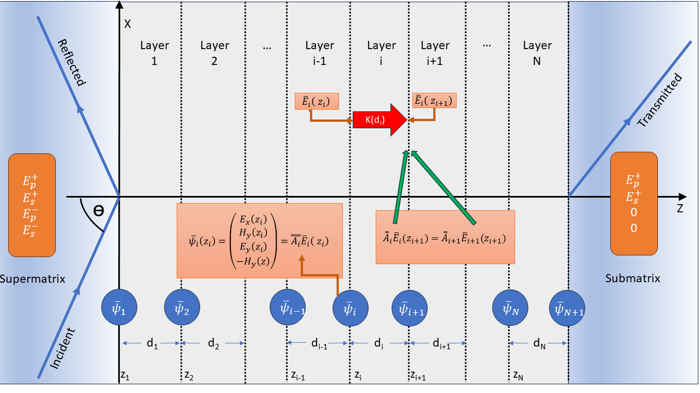

.. include:: preamble.txt

..
    .. contents::
       :local:
..

.. meta::
   :description: PDielec package crystal Raman theory
   :keywords: Raman, Crystal, Layer, Transfer Matrix, Scattering Matrix, Reciprocity

.. _Crystal-Raman-Theory:

================================
Theory for Crystal Layer Raman
================================

The *Crystal Raman* calculation models Raman scattering from a crystal slab or a multilayer
stack.  It combines the Raman tensors and phonon frequencies from a lattice-dynamical
calculation with the optical electric fields calculated by the transfer matrix or scattering
matrix methods described in :ref:`Single-Crystal-Theory`.

The method is intended for non-resonant Raman scattering from homogeneous Raman-active
layers.  The incident laser field and the reciprocal scattered field may be modified by
refraction, reflection, absorption and interference within the stack.  These effects are
included by evaluating the electric fields throughout each Raman-active layer and
integrating the Raman source over the layer thickness.

Geometry
--------

The crystal layer uses the same laboratory frame as the single-crystal infrared calculation.
The layer surface lies in the :math:`XY` plane and the surface normal is the laboratory
:math:`Z` direction.  The incident radiation lies in the :math:`XZ` plane; p-polarised light
is polarised in this plane and s-polarised light is polarised along :math:`Y`.

.. _fig-crystal-raman-layers:

   Raman scattering from a multilayer system.

The laser is incident with angle :math:`\theta_L`.  The detector may be on the superstrate
side for backscattering or on the substrate side for forward scattering.  The detected
scattered radiation has frequency

.. math::
   :label: eq-crystal-raman-scattered-frequency

   \nu_S = \nu_L - \nu_m

for Stokes scattering from mode :math:`m`.

Layer Raman Amplitude
---------------------

At a point :math:`z_s` inside a Raman-active layer the scattering amplitude of mode
:math:`m` is

.. math::
   :label: eq-crystal-raman-local-amplitude

   A_m(z_s) \propto
   \mathbf{E}_S(z_s,\nu_S)^T
   \tensorbf{R}^{(m)}_{lab}
   \mathbf{E}_L(z_s,\nu_L)

where :math:`\mathbf{E}_L` is the local electric field produced by the incident laser,
:math:`\mathbf{E}_S` is the reciprocal field associated with the detected scattered channel,
and :math:`\tensorbf{R}^{(m)}_{lab}` is the Raman tensor rotated into the laboratory frame.
The transpose on :math:`\mathbf{E}_S` is not a Hermitian conjugate; this is the usual
reciprocity overlap used for Raman scattering from layered optical systems.

For a homogeneous layer :math:`\ell`, the layer amplitude is obtained by integrating through
the layer thickness,

.. math::
   :label: eq-crystal-raman-layer-amplitude

   A_{\ell m} =
   \int_{z_\ell}^{z_{\ell+1}}
   \mathbf{E}_S(z,\nu_S)^T
   \tensorbf{R}^{(m)}_{\ell,lab}
   \mathbf{E}_L(z,\nu_L)\,dz

PDielec evaluates this integral numerically using Gauss-Legendre quadrature points inside
each Raman-active layer.

Optical Fields
--------------

The fields :math:`\mathbf{E}_L` and :math:`\mathbf{E}_S` are calculated from the same
transfer matrix or scattering matrix machinery used for single-crystal infrared spectra.
At optical laser frequencies the phonon contribution to the permittivity is not included;
the high-frequency optical permittivity of each material is used for propagation through
the stack.

The incident field :math:`\mathbf{E}_L(z,\nu_L)` is calculated in the original multilayer
system at the laser frequency.  The scattered field is calculated at the shifted frequency
:math:`\nu_S`.  For backscattering the reciprocal field is launched from the superstrate
side.  For forward scattering it is launched from the substrate side, which is implemented
by using the reversed stack and mapping each integration point to the corresponding
position in that reversed system.

The detected channel can be p-polarised, s-polarised, or unpolarised.  In the unpolarised
case the p- and s-detected intensities are summed incoherently.

Raman Tensor Orientation
------------------------

The Raman tensor from the quantum mechanical calculation is defined in the crystal
coordinate frame.  If :math:`\tensorbf{G}` maps vectors from the crystal frame to the
laboratory frame,

.. math::
   :label: eq-crystal-raman-vector-rotation

   \mathbf{v}_{lab} = \tensorbf{G}\mathbf{v}_{crystal}

then the laboratory Raman tensor is

.. math::
   :label: eq-crystal-raman-tensor-rotation

   \tensorbf{R}^{(m)}_{lab} =
   \tensorbf{G}\tensorbf{R}^{(m)}_{crystal}\tensorbf{G}^{T}

The rotation includes the surface orientation, specified by the layer Miller indices, and the
azimuthal rotation about the laboratory :math:`Z` axis.  This allows the Raman intensity to
be calculated as a function of azimuthal angle.

Combining Layers and Modes
--------------------------

For one mode, the layer amplitudes may be combined coherently or incoherently.  Coherent
combination sums amplitudes before squaring,

.. math::
   :label: eq-crystal-raman-coherent

   I_m \propto \left|\sum_\ell A_{\ell m}\right|^2

whereas incoherent combination sums the layer intensities,

.. math::
   :label: eq-crystal-raman-incoherent

   I_m \propto \sum_\ell \left|A_{\ell m}\right|^2

This layer summation option is distinct from the *Coherent* or *Incoherent*
choice in the layer table.  The layer-table option controls optical propagation
through that layer: whether the transfer/scattering matrix calculation retains
phase interference from internal reflections, averages over phase, or treats a
thick layer approximately.  It therefore changes the optical fields
:math:`\mathbf{E}_L` and :math:`\mathbf{E}_S` used in the Raman overlap.

The *Layer combination* option controls only how Raman amplitudes from different
Raman-active layers are combined after those optical fields have been calculated.
Use *Incoherent intensities* when separate active layers should contribute
independent intensities, and use *Coherent amplitudes* only when Raman emission
from those layers is expected to retain a fixed phase relationship and interfere.

The *Depth coherence* option is a third, more local coherence choice.  It controls
how Raman sources are combined through the thickness of each individual
Raman-active layer.  *Coherent amplitude* integrates the complex source amplitude
before squaring, which is appropriate for thin coherent films:

.. math::
   :label: eq-crystal-raman-depth-coherent

   I_{\ell m} \propto
   \left|
   \int_{\ell}
   \mathbf{E}_S(z,\nu_S)^T
   \tensorbf{R}^{(m)}_{\ell,lab}
   \mathbf{E}_L(z,\nu_L)\,dz
   \right|^2 .

*Incoherent intensity* integrates the local intensity:

.. math::
   :label: eq-crystal-raman-depth-incoherent

   I_{\ell m} \propto
   \int_{\ell}
   \left|
   \mathbf{E}_S(z,\nu_S)^T
   \tensorbf{R}^{(m)}_{\ell,lab}
   \mathbf{E}_L(z,\nu_L)
   \right|^2\,dz ,

which is more appropriate for thick or bulk samples where long-range Raman phase
coherence is not physical.  When *Incoherent intensity* is selected, PDielec also
forces separate Raman-active layers to be combined as incoherent intensities,
because there is then no well-defined layer amplitude to add coherently.

The mode intensity is then multiplied by the Stokes thermal factor,

.. math::
   :label: eq-crystal-raman-bose-factor

   \frac{n(\nu_m)+1}{\nu_m}

where :math:`n(\nu_m)` is the Bose-Einstein occupation factor.  The final spectrum is
formed by applying Lorentzian broadening to each active mode,

.. math::
   :label: eq-crystal-raman-spectrum

   I(\Delta\nu) =
   \sum_m
   I_m
   \frac{\sigma_m}{(\Delta\nu-\nu_m)^2+\sigma_m^2}

where :math:`\sigma_m` is the Lorentzian half-width at half maximum.

Layer Phonon Frequencies
------------------------

The optical field calculation and the active-layer vibrational calculation are separate
parts of the model.  The transfer or scattering matrix calculation determines the laser
field and the reciprocal scattered field at optical frequencies.  It does not, by itself,
change the phonon frequencies.  Any shift of an infrared-active Raman mode away from the
bulk transverse-optic value must therefore be included in the phonon dynamical matrix used
for the Raman-active layer.

For each Raman-active layer PDielec starts from the transverse-optic dynamical matrix,
the mass-weighted Born charge tensor and the Raman tensor of the layer material.  The
phonon-induced polarisation is written as

.. math::
   :label: eq-crystal-raman-phonon-polarisation

   \mathbf{P}_{ph} = \frac{1}{V}\tensorbf{Z}^{mw}\mathbf{x}

where :math:`\mathbf{x}` is the mass-weighted normal-coordinate displacement vector and
:math:`V` is the unit-cell volume used for the Born charges.  A macroscopic electrostatic
field generated by this polarisation gives an additional restoring-force term,

.. math::
   :label: eq-crystal-raman-layer-dynamical

   \tensorbf{D}^{eff} =
   \tensorbf{D}^{TO} +
   \frac{1}{\epsilon_0 V}
   \left(\tensorbf{Z}^{mw}\right)^T
   \tensorbf{S}_{ph}
   \tensorbf{Z}^{mw}

where :math:`\tensorbf{S}_{ph}` is the phonon-field screening tensor.  Different choices
of :math:`\tensorbf{S}_{ph}` define the phonon-frequency model for the active layer.
After the correction has been applied, :math:`\tensorbf{D}^{eff}` is diagonalised and the
resulting frequencies and eigenvectors are used to form the Raman spectrum.  The Raman
tensors are transformed consistently with the corrected eigenvectors when mode mixing is
introduced by the macroscopic field correction.

PDielec provides four levels of treatment for the active-layer phonon frequencies.
These levels should be regarded as separate approximations for the phonon problem, not as
alternatives for solving the optical propagation problem.

**TO — bulk TO frequencies** (GUI label: *TO*)
   No macroscopic phonon-field correction is applied:

   .. math::
      :label: eq-crystal-raman-level1-screening

      \tensorbf{S}_{ph}=\tensorbf{0},
      \qquad
      \tensorbf{D}^{eff}=\tensorbf{D}^{TO}

   This is appropriate for modes that are not infrared active, for calculations where the
   long-range electric field is deliberately neglected, or as a reference calculation.  It
   is also the most direct comparison with a conventional Placzek Raman calculation using
   the bulk transverse-optic phonon frequencies.

**Snell's law — travelling-wave NAC correction** (GUI label: *Snell's law* or *Snell's law (EO)*)
   The phonon is assigned the momentum carried by the Raman process.  In the laboratory
   frame,

   .. math::
      :label: eq-crystal-raman-qph

      \mathbf{q}_{ph}=\mathbf{k}_{L}-\mathbf{k}_{S}

   where :math:`\mathbf{k}_{L}` is the optical wave vector of the laser field in the
   active layer and :math:`\mathbf{k}_{S}` is the wave vector of the emitted Stokes photon
   in the same layer.  The direction
   :math:`\hat{\mathbf{q}}_{ph}=\mathbf{q}_{ph}/|\mathbf{q}_{ph}|` is used in the usual
   non-analytic correction.  After rotating the layer background permittivity into the
   laboratory frame, the screening tensor is

   .. math::
      :label: eq-crystal-raman-nac-screening

      \tensorbf{S}^{NAC}_{ph} =
      \frac{\hat{\mathbf{q}}_{ph}\hat{\mathbf{q}}_{ph}^{T}}
           {\hat{\mathbf{q}}_{ph}^{T}
            \tensorbs{\varepsilon}^{b}_{i,lab}
            \hat{\mathbf{q}}_{ph}}

   This is the bulk non-analytic correction evaluated for the Raman scattering geometry.
   It is useful when the phonon is treated as a propagating long-wavelength bulk mode in
   the active material.  In a multilayer calculation the optical fields may contain several
   forward and backward components.  The implementation therefore uses the wave-vector
   branch associated with the selected incident and detected optical channels; if more than
   one branch is retained, the corresponding Raman contributions are evaluated and combined
   using the same coherent or incoherent choices as the optical Raman amplitudes.

**Dominant mode — dominant Berreman eigenmode** (GUI label: *Dominant mode* or *Dominant mode (EO)*)
   Instead of the macroscopic Snell's-law estimate, the phonon wavevector direction is
   taken from the actual Berreman eigenvalue of the dominant forward-propagating optical
   mode in the active layer.  The generalised transfer matrix (GTM) system is solved at
   the laser frequency :math:`\nu_L` to obtain the four Berreman :math:`k_z` eigenvalues
   of the layer; the transmitted-p eigenvalue is used for p-polarised incidence and the
   transmitted-s eigenvalue for s-polarised incidence.  A second GTM solve at the
   collection geometry gives the corresponding Stokes :math:`k_z`.  The phonon momentum
   transfer in the reduced wavevector :math:`(\zeta, 0, q_z)` space is then

   .. math::
      :label: eq-crystal-raman-dominant-q

      \mathbf{q}_{ph} \propto
      \begin{pmatrix}\zeta_L - \zeta_S \\ 0 \\ q_{z,L} - q_{z,S}\end{pmatrix}
      \quad\text{(backscattering: } \zeta_L+\zeta_S,\; q_{z,L}+q_{z,S}\text{)}

   where :math:`\zeta = n\sin\theta` is the in-plane reduced wavevector component.
   This accounts for optical anisotropy and birefringence that are neglected by the
   isotropic Snell's-law approximation of Level 2.  The resulting unit vector
   :math:`\hat{\mathbf{q}}_{ph}` is used in the same NAC dynamical-matrix correction
   as above.

**All modes — per Berreman q-channel-pair NAC** (GUI label: *All modes* or *All modes (EO)*)
   This level decomposes the incident and reciprocal scattered fields into Berreman
   propagation channels in each Raman-active layer.  Numerically distinct Berreman
   eigenvectors that have the same propagation :math:`q_z` within tolerance are first
   summed coherently into a single q-channel.  This is important at normal incidence
   and in other degenerate or nearly-degenerate cases, where the individual Berreman
   eigenvectors are not unique but their summed field in a propagation subspace is
   unique.

   The NAC correction is then evaluated separately for every combination of incident
   q-channel :math:`i_L` and scattered q-channel :math:`j_S`.  For each pair a
   dedicated phonon wavevector :math:`\hat{\mathbf{q}}^{ij}_{ph}` is formed from the
   corresponding reduced in-plane wavevectors and :math:`q_z` values,

   .. math::
      :label: eq-crystal-raman-modal-pair-q

      \mathbf{q}^{ij}_{ph} \propto
      \begin{pmatrix}
      \zeta_L-\zeta_S \\
      0 \\
      q^i_{z,L}-q^j_{z,S}
      \end{pmatrix}.

   If :math:`|\mathbf{q}^{ij}_{ph}|` is negligible, that pair uses the uncorrected
   TO phonons.  Otherwise the NAC dynamical matrix is solved for
   :math:`\hat{\mathbf{q}}^{ij}_{ph}`, giving a q-resolved phonon frequency and Raman
   tensor for the pair.  Since different q-channel pairs can give different corrected
   frequencies for the same original TO mode, one input mode can produce more than one
   spectral line.

   The default modal-pair combination policy is *Group q channels*.  Amplitudes whose
   phonon momentum and detected polarisation are the same are added coherently before
   squaring; different phonon-q final states are summed as intensities,

   .. math::
      :label: eq-crystal-raman-modal-pairs

      I_m \propto
      \sum_g
      \left|
      \sum_{(i_L,j_S)\in g} A^{ij}_m
      \right|^2 ,

   where :math:`g` labels a common phonon-q and detector-channel group.  This is the
   physically recommended setting and is the one used for normal calculations.  Two
   diagnostic alternatives are also available in the GUI: *Incoherent pairs*, which
   squares each q-channel-pair amplitude independently, and *Coherent all pairs*, which
   sums all modal-pair amplitudes before squaring and therefore mixes distinct
   phonon-momentum final states.

   This is the most complete treatment available and reduces to the dominant-mode
   result when only one q-channel is significant in each geometry.

For an infrared-inactive mode :math:`\tensorbf{Z}^{mw}` gives no macroscopic restoring-force
correction, so all four levels reduce to the same transverse-optic frequency.  For polar
modes the corrected frequencies and Raman tensors depend on the surface orientation and
the optical scattering geometry.  The optical field enhancement and interference factors
are still calculated separately at :math:`\nu_L` and :math:`\nu_S`; they should not be
interpreted as replacing the phonon-frequency correction described here.

Electro-Optic Correction to the Raman Tensor
---------------------------------------------

For non-centrosymmetric polar crystals the Raman tensor also receives an electro-optic
(EO) contribution that arises from the macroscopic electric field accompanying each
infrared-active phonon.  This field, directed along :math:`\hat{\mathbf{q}}`, modulates
the optical susceptibility through the second-order non-linear susceptibility
:math:`\tensorbs{\chi}^{(2)}`.  The result is a correction to the Raman tensor of each
NAC-corrected mode that depends on the phonon wavevector direction.

The EO contribution to the Raman tensor of mode :math:`p` is

.. math::
   :label: eq-crystal-raman-eo-correction

   \Delta\tensorbf{R}^{(p)}_{ij} =
   -\frac{2\,f_{ij}\,s_p}
         {\hat{\mathbf{q}}^T\tensorbs{\varepsilon}^b\hat{\mathbf{q}}}

where the electro-optic factor :math:`\tensorbf{f}` is the contraction of
:math:`\tensorbs{\chi}^{(2)}` with the phonon unit wavevector,

.. math::
   :label: eq-crystal-raman-eo-f

   f_{ij} = \sum_l \chi^{(2)}_{ijl}\,\hat{q}_l

and :math:`s_p` is the projection of the Born-charge weighted polarisation onto the
phonon eigenvector,

.. math::
   :label: eq-crystal-raman-eo-scalar

   s_p = \left(\tensorbf{Z}^{mw\,T}\hat{\mathbf{q}}\right) \cdot \mathbf{x}_p

with :math:`\mathbf{x}_p` the mass-weighted eigenvector of mode :math:`p` after NAC
mixing, and :math:`\hat{\mathbf{q}}^T\tensorbs{\varepsilon}^b\hat{\mathbf{q}}` the
background permittivity along the phonon wavevector direction.  The corrected Raman
tensor for each mode is

.. math::
   :label: eq-crystal-raman-eo-total

   \tensorbf{R}^{(p)}_{corrected} =
   \tensorbf{R}^{(p)}_{TO,mix} + \Delta\tensorbf{R}^{(p)}

where :math:`\tensorbf{R}^{(p)}_{TO,mix}` is the Raman tensor after mode mixing from
the NAC dynamical-matrix correction.

The EO correction vanishes identically when:

* mode :math:`p` is not infrared active (i.e. :math:`\tensorbf{Z}^{mw\,T}\hat{\mathbf{q}}` is
  orthogonal to :math:`\mathbf{x}_p`),
* :math:`\tensorbs{\chi}^{(2)} = 0` (centrosymmetric crystals), or
* the *TO* level is selected (no NAC correction applied).

**Availability of** :math:`\tensorbs{\chi}^{(2)}` **from DFT codes**

PDielec reads :math:`\tensorbs{\chi}^{(2)}` automatically from the DFT output file when
it is present.  Both supported codes report the *d*-tensor
(:math:`\tensorbf{d} = \tfrac{1}{2}\tensorbs{\chi}^{(2)}`); PDielec stores
:math:`\tensorbs{\chi}^{(2)} = 2\tensorbf{d}` internally after converting the
reported pm/V values to the same Angstrom-based convention used by the reader
:math:`R_\epsilon` Raman tensors.

*CASTEP* writes a 3×6 Voigt-format block labelled
``Nonlinear Optical Susceptibility (pm/V)`` in the ``.castep`` output file.  The
Voigt column order is :math:`(11, 22, 33, 23, 13, 12)`, giving the full
3×3×3 tensor after symmetrisation of the last two indices.

*Abinit* writes a 27-row table labelled
``Non-linear optical susceptibility tensor d (pm/V)``
in the ``.abo`` output file, listing all index combinations :math:`(i_1, i_2, i_3)` in
Cartesian coordinates with 1-based integer indices.

When :math:`\tensorbs{\chi}^{(2)}` data are present and any level other than *TO* is
selected, PDielec applies the EO correction to every NAC-rotated Raman tensor before
computing the Raman spectrum.  The GUI labels for the three NAC levels then show an
*(EO)* suffix (*Snell's law (EO)*, *Dominant mode (EO)*, *All modes (EO)*) to make
clear that the electro-optic correction is active.  A log message also confirms this
at calculation time.
