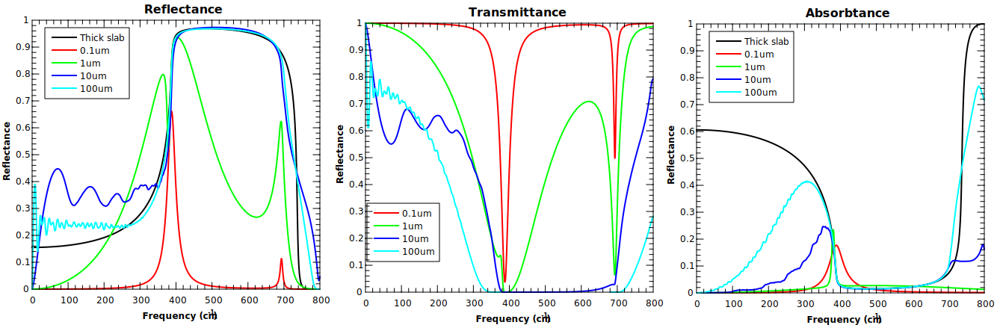
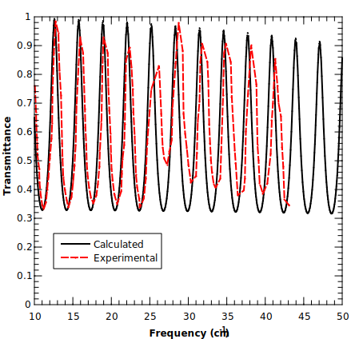
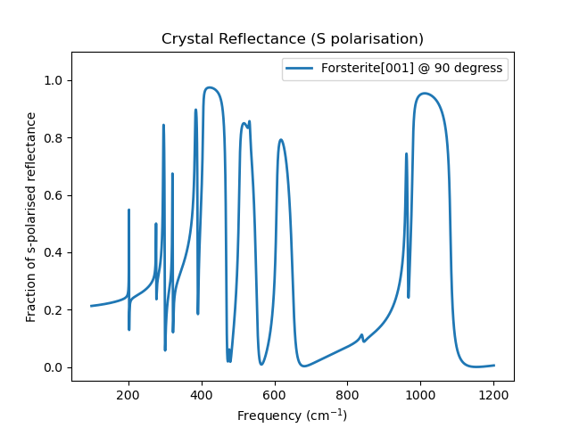
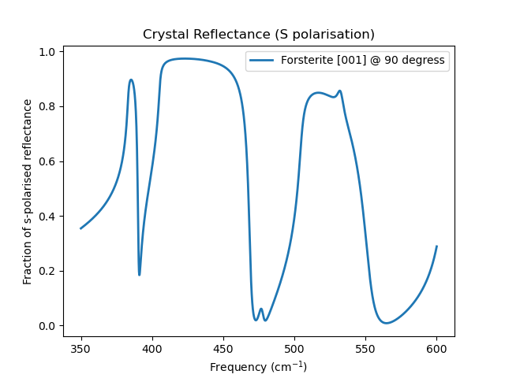

.. include:: preamble.txt

..
    .. contents::
       :local:
..

.. meta::
   :description: PDielec package for the calculation of infrared and terahertz absorption from QM calculations
   :keywords: Quantum Mechanics, Effective Field Theory, Maxwell, Garnett, Mie, Infrared, Terahertz, Castep, Abinit, VASP, GULP. QE

===========================
Single Crystal Applications
===========================

The transmission, reflection and absorption of infrared light through single crystals can be simulated using PDielec and PDGui.  Partial incoherence can be modelled by averaging over a sample of thicknesses and orientations.

Single Crystal Study of Thickness Effects in MgO
================================================

This example looks at an isotropic system.  The results of a CASTEP calculation of MgO have provided the frequency dependent permittivity and this is used to look at the effect of crystal thickness on the reflectance, transmittance and absorptance.i
The examples shown here were calculated using the scripts mgo_coherent_size_effects.py and mgo_partially_incoherent_size_effects in the Examples/SingleCrystal/MgO directory of the GitHub distribution.
A 45\ :superscript:`o` incident beam on the (001) surface of MgO is used to calculate the transmittance, reflectance and absorbtance of thin films with thickness of 0.1, 1, 10 and 100 microns.
The results of the coherent calculations are shown in :numref:`fig-mgo-coherent`

.. _fig-mgo-coherent:
.. figure:: ./_static/Figures/MgO_Coherent_Size_Effects.svg
   :scale: 90%

   Effects of Film Thickness of MgO in Coherent Light

The results for the 'thick slab' case are shown only for reflectance and absorbtance.  It can be clearly seen that the reflection in the restrahlen region between the TO and LO frequencies (388 and 693 |cm1|) is almost total with also very little absorbtance.  
The 0.1 |micron| thickness shows peaks in reflectance and corresponding drops in transmittance at both the TO and LO frequencies, whilst showing only absorbtance at the TO frequency.
The 1 |micron| thickness shows considerable broadening of these signals, with the TO reflectance splitting into a doublet. 
At 10 |micron| below the TO frequency there are oscillations in the reflectance, transmittance and absorptance which are a result of interference between the internally reflected waves.  They occur because the light is coherent.  The oscillations continue until they meet the 'thick slab' limit and they then follow this limit until frequencies above the LO frequency.
At 100 |micron| the oscillations below the TO frequency are very fast and the reach the 'thick slab' limiting case at lower frequencmes than for the 10 |micron| case.  Similarly at higher frequencies the follow the 'thick slab' limiting case to higher frequency.

Th introduction of partial incoherence is acheived in the program by averaging over a range of orientation parameters and is therefore quite crude, but it gives an indication of the type of effects that partial incoherence may have.
The term partial incoherence in this case is used to refer to incoherence introduced by sample defects such as planarity and varying thickness.

:numref:`fig-mgo-partially-incoherent` shows the smoothing effect that averaging over the orientation and thickness parameters has.
It is clear, especially from the absorbtance figure, that the thicker samples are a better fit to the 'thick slab' limiting case.  
However there are issues when using this facility.  In particular the high frequency side of the reflectance spectra is showing shoulders which are artefacts of the quite large perturbations in the orientation and thickness parameters which have been imposed.
Also, for the 10 |micron| sample it is clear that these perturbations are not sufficient by themselves to remove the oscillations that occur at low frequencies.  
This is because at these frequencies the changes in thickness are not sufficent to move a peak by the period of the oscillations.

.. _fig-mgo-partially-incoherent:

   Effects of Partial Incoherence and Film Thickness of MgO

Komandin et al :cite:`Komandin2009` have reported terahertz spectra of 0.5 |micron| thick MgO crystals which are dominated by interference at low frequencies.  
In :numref:fig-mgo-experiment a digitised spectrum obtained from this publication is compared with calculations.
It can be seen that despite the rather poor digitisation the agreement is very good, given that we are using only calculated information (refractive index, LO and TO frequencies etc.).
Agreement with the number of interference bands and the amplitude of the bands is very good.

.. _fig-mgo-experiment:

   Comparison of calculated and experimental transmittance terahertz spectra

Finally we compare a digitised spectrum of the reflectance measured over the range 0 - 800 |cm1| with the spectrum calculated using PDGui and Castep. 
In this the 'thick slab' approximation has been used as no oscillations are detected in the low frequency experimental results.
The calculated and experimental results are in excellent agreement.
The shoulder on the experimental result is due to two phonon processes which are not taken account of in the present theoretical work.

.. _fig-mgo-experiment-reflectance:
.. figure:: ./_static/Figures/MgO_Single_Crystal_Experiment_Reflectance.svg
   :scale: 90%

   Comparison of calculated and experimental reflectatance infrared spectra

Single Crystal Study of Forsterite
==================================

In a publication on the interpretation of the experimental spectrum of forsterite :cite:`Pierre2013a` a Four Parameters Semi-Quantum (FPSQ) model for the single crystal infrared spectrum of this material was presented.   In this application note that we use the experimental file format of PDielec to read in the FPSQ model parameters from the paper and use it to calculate the reflectance spectrum for comparison with that published in the paper.
The FPSQ model is defined by the following equation.

.. math::
   :label: eq-fpsqa

    \epsilon (\omega )=\epsilon _{\infty}\prod_{j} \frac{\Omega^2_{LO_j}-\omega ^2-i\gamma _{LO_j}\omega }{\Omega^2_{TO_j}-\omega ^2-i\gamma _{TO_j}\omega}

Forsterite is an orthosilicate belonging to an orthorhombic space group.  The permittivity matrix is diagonal when the x, y and z axes of the crystal are aligned with a, b and c axes of the unit cell.  The parameters for the FPSQ model are summarised in the tables below.

.. table:: Optical Permittivity
   :name: tab-optical
   :column-alignment:  center right  right  right
   :header-alignment:  center center center center 
   :column-dividers:   none single single single none

   +------------+------------+--------+--------+
   |            |     X      | Y      |  Z     |
   +------------+------------+--------+--------+
   |    X       | 2.83       | 0.0    | 0.0    |
   +------------+------------+--------+--------+
   |    Y       | 0.0        | 2.69   | 0.0    |
   +------------+------------+--------+--------+
   |    Z       | 0.0        | 0.0    | 2.76   |
   +------------+------------+--------+--------+

.. table:: FPSQ Model Parameters for Forsterite
   :name: tab-fpsqa
   :widths:                   1      1      1      1      1      1      1      1      1      1      1      1
   :column-dividers:   single single single single single single single single single single single single single single
   :column-alignment:         center center center center center center center center center center center center
   :header-alignment:         right  right  right  right  right  right  right  right  right  right  right  right 

   +----------------------------------------+----------------------------------------+----------------------------------------+
   | EPS(xx)                                | EPS(yy)                                | EPS(zz)                                |
   +---------+---------+---------+----------+---------+---------+---------+----------+---------+---------+---------+----------+
   | TO Freq | TO sigma| LO Freq | LO sigma | TO Freq | TO sigma| LO Freq | LO sigma | TO Freq | TO sigma| LO Freq | LO sigma |
   +=========+=========+=========+==========+=========+=========+=========+==========+=========+=========+=========+==========+
   | 202.6   |0.18     |202.9    | 0.28     | 144.9   |0.09     |145.5    | 0.21     | 278.3   |0.50     | 278.9   | 0.54     |
   +---------+---------+---------+----------+---------+---------+---------+----------+---------+---------+---------+----------+
   | 276.6   |0.59     |277.1    | 0.84     | 278.6   |0.68     |278.9    | 0.79     | 292.7   |0.90     | 305.6   | 0.36     |
   +---------+---------+---------+----------+---------+---------+---------+----------+---------+---------+---------+----------+
   | 296.1   |0.79     |300.6    | 1.18     | 290.8   |1.28     |311.3    | 0.68     | 306.3   |0.39     | 316.7   | 0.53     |
   +---------+---------+---------+----------+---------+---------+---------+----------+---------+---------+---------+----------+
   | 321.1   |0.60     |322.5    | 0.88     | 351.7   |2.77     |376.7    | 1.02     | 411.6   |2.03     | 414.6   | 1.97     |
   +---------+---------+---------+----------+---------+---------+---------+----------+---------+---------+---------+----------+
   | 383.2   |1.52     |390.5    | 1.52     | 397.3   |2.15     |412.4    | 2.30     | 418.5   |3.19     | 456.4   | 1.88     |
   +---------+---------+---------+----------+---------+---------+---------+----------+---------+---------+---------+----------+
   | 405.4   |1.58     |468.9    | 2.90     | 419.8   |2.17     |444.1    | 2.75     | 425.0   |4.22     | 424.5   | 3.83     |
   +---------+---------+---------+----------+---------+---------+---------+----------+---------+---------+---------+----------+
   | 476.6   |4.46     |478.0    | 3.69     | 458.1   |4.39     |489.2    | 2.59     | 478.9   |3.22     | 487.2   | 3.99     |
   +---------+---------+---------+----------+---------+---------+---------+----------+---------+---------+---------+----------+
   | 504.7   |3.81     |532.6    | 5.65     | 507.8   |2.77     |513.7    | 4.16     | 506.2   |2.71     | 580.8   | 8.79     |
   +---------+---------+---------+----------+---------+---------+---------+----------+---------+---------+---------+----------+
   | 532.3   |5.67     |552.3    | 9.41     | 529.5   |4.62     |575.0    | 8.33     | 874.4   |4.17     | 996.8   | 4.32     |
   +---------+---------+---------+----------+---------+---------+---------+----------+---------+---------+---------+----------+
   | 606.6   |4.77     |651.6    | 12.10    | 838.6   |6.56     |844.5    | 7.63     |         |         |         |          |
   +---------+---------+---------+----------+---------+---------+---------+----------+---------+---------+---------+----------+
   | 840.8   |6.75     |841.5    | 7.03     | 872.9   |5.02     |965.2    | 3.33     |         |         |         |          |
   +---------+---------+---------+----------+---------+---------+---------+----------+---------+---------+---------+----------+
   | 959.9   |2.41     |965.5    | 3.30     | 986.3   |4.80     |994.8    | 2.96     |         |         |         |          |
   +---------+---------+---------+----------+---------+---------+---------+----------+---------+---------+---------+----------+
   | 978.5   |3.83     |1081.1   | 5.76     |         |         |         |          |         |         |         |          |
   +---------+---------+---------+----------+---------+---------+---------+----------+---------+---------+---------+----------+

The publication presents experimental polarised reflectance infrared spectra of single crystals of forsterite.  The incident beam angle to the sample was :math:`10^{\circ}`.  The s-polarised geometry was used and measurements made with the electric field parallel to the a-axis, b-axis and c-axis.

In PDGui the laboratory frame is defined by XYZ, with the incident and reflected light in the surface in the XZ plane, with the surface normal aligned with the Z-axis.
The surface is therefore in the XY plane.
The azimuthal angle can be used to rotate the crystal about the normal until the crystal axis of interest is parallel to the Y axis of the laboratory frame.
With this geometry the s-polarised wave field will be oscillating parallel to the chosen axis.
The arrangement described is shown in the Figure below where :math:`E_s` and :math:`E_p` are the field directions of the incident light. 

.. _fig-lab-coords:

.. figure:: ./_static/Figures/SingleCrystalGeometry.png
   :scale: 90%

   Definition of single crystal laboratory coordinates in PDGui

As can be seen :math:`E_s` is parallel to the laboratory Y-axis, so it is necessary to line up the crystal unit cell so that the cell direction being investigated is parallel to the Y-axis.
In the single crystal scenario tab PDGui shows the crystal axes in terms of the laboratory coordinates so it is relatively straightforward to make sure that the cell direction of interest is aligned along the Y-axis.  It is possible to set each axis in one of two ways, depending on the surface being used.  For example to make sure the a-axis is aligned with laboratory Y-axis, we can use either the [001] or the [010] surfaces and simply choose the appropriate azimuthal angle.

The following geometries can be used by PDGui to ensure the relevant axis is aligned with the laboratory Y-axis;

- For the a-axis; 
    | the [001] surface with azimuthal angle =  90
    | the [010] with azimuthal angle = 90
- For the b-axis
    | the [001] surface and azimuthal angle = 0
    | the [100] surface and azimuthal = 90
- for the c-axis
    | the [100] surface azimuthal angle = 0
    | the [010] surface azimuthal angle = 0

The two figures below show the reflectance on s-polarised light along the a-axis and these figures show very good agreement with Figure 1 in the published experimental work :cite:`Pierre2013a`.
The data for this calculation can be found by looking in the :ref:`Examples` section of the installation guide under the Experimental/forsterite example.

.. _forsterite:

   Forsterite a-axis reflectance (upper figure 100 - 1200 |cm-1|, lower figure 350 - 600 |cm-1|)

