.. include:: preamble.txt

Viewer and Fitter Settings Views
================================

These snapshots show the individual settings tabs described in :doc:`pdgui`.
Use the arrows at the right of a tab strip to reach the remaining tabs.
The viewer uses ZnO; the Fitter uses the sodium-sulphate ATR example.

Viewer: Elements
----------------

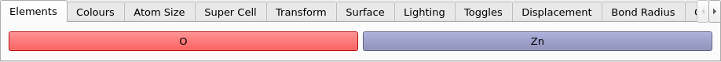

   The Elements settings tab.

Viewer: Colours
---------------

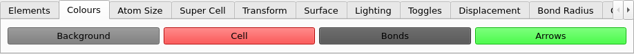

   The Colours settings tab.

Viewer: Atom Size
-----------------

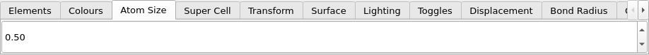

   The Atom Size settings tab.

Viewer: Super Cell
------------------

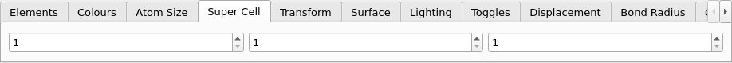

   The Super Cell settings tab.

Viewer: Transform
-----------------

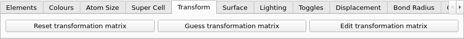

   The Transform settings tab.

Viewer: Surface
---------------

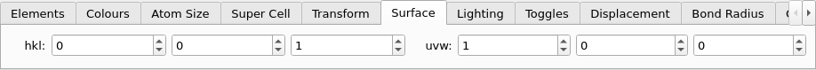

   The Surface settings tab.

Viewer: Lighting
----------------

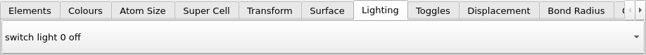

   The Lighting settings tab.

Viewer: Toggles
---------------

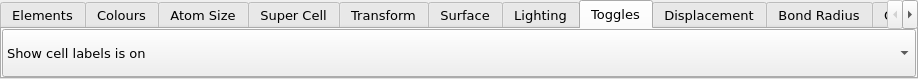

   The Toggles settings tab.

Viewer: Displacement
--------------------

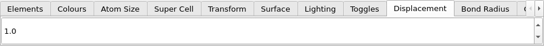

   The Displacement settings tab.

Viewer: Bond Radius
-------------------

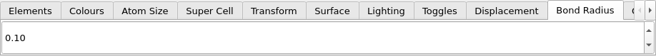

   The Bond Radius settings tab.

Viewer: Cell Radius
-------------------

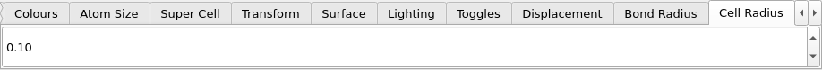

   The Cell Radius settings tab.

Viewer: Arrow Radius
--------------------

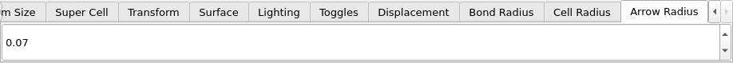

   The Arrow Radius settings tab.

Fitter: Experimental spectrum
-----------------------------

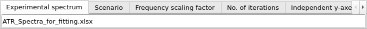

   The Experimental spectrum settings tab.

Fitter: Scenario
----------------

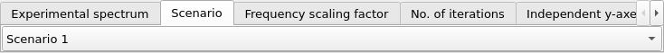

   The Scenario settings tab.

Fitter: Frequency scaling factor
--------------------------------

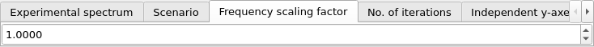

   The Frequency scaling factor settings tab.

Fitter: No. of iterations
-------------------------

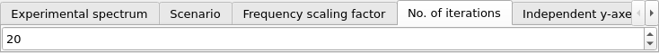

   The No. of iterations settings tab.

Fitter: Independent y-axes
--------------------------

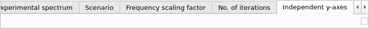

   The Independent y-axes settings tab.

Fitter: Fitting type
--------------------

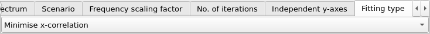

   The Fitting type settings tab.

Fitter: Optimise scaling
------------------------

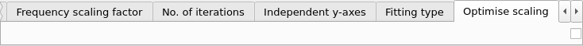

   The Optimise scaling settings tab.

Fitter: Spectral difference threshold
-------------------------------------

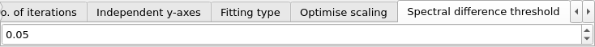

   The Spectral difference threshold settings tab.

Fitter: Baseline removal
------------------------

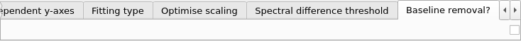

   The Baseline removal settings tab.

Fitter: HP Filter Lambda
------------------------

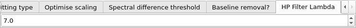

   The HP Filter Lambda settings tab.
