.. include:: preamble.txt

.. meta::
   :description: PDGui guide to infrared, ATR and Raman calculations, scenarios and visualisation
   :keywords: PDielec, PDGui, Infrared, ATR, Raman, Electro-optic, NAC, GUI

=====
PDGui
=====

PDGui provides a graphical front end to PDielec. It reads a material's structure
and response from a QM/MM calculation or a user-supplied input file, and
calculates infrared, ATR or Raman spectra. The interface is a notebook with
*Main*, *Settings*, *Scenario*, *Plotting*, *Analysis*, *3D Viewer* and *Fitter*
tabs. Additional scenarios appear as additional tabs.

Starting PDGui
==============

PDGui can be run without arguments, or with an output file. It makes a best
guess at the program from the filename and associated files. For example::

    pdgui
    pdgui OUTCAR
    pdgui raman.castep -spectroscopy crystal_raman
    pdgui raman.castep -spectroscopy powder_raman
    pdgui experiment material.exp
    pdgui finite_field zno-raman.json -spectroscopy crystal_raman
    pdgui "quantum espresso" run1.dynG

Use the full *quantum espresso* name when explicitly selecting that reader.
A program name can also be supplied with ``-program``. For a saved session use
``pdgui -script script.py``. To calculate and write a spreadsheet without
remaining in the GUI, use::

    pdgui -script script.py -spreadsheet results.xlsx -nosplash -exit

.. list-table:: Common command-line options
   :header-rows: 1
   :widths: 1 3

   * - Option
     - Description
   * - ``-spectroscopy type``
     - Initial spectroscopy: ``powder_infrared`` (default), ``crystal_infrared``,
       ``powder_raman`` or ``crystal_raman``. Select *Powder ATR* in the
       Settings Tab or a script.
   * - ``-program name``
     - Explicit input program, for example ``castep``, ``experiment`` or ``finite_field``.
   * - ``-script filename``
     - Read a Python settings script.
   * - ``-spreadsheet filename``
     - Write results to an Excel file with an ``.xlsx`` extension.
   * - ``-cpus N``
     - Number of workers; zero selects the available physical cores.
   * - ``-threading``
     - Use threads instead of the default worker processes.
   * - ``-nosplash``
     - Suppress the splash window.
   * - ``-exit``
     - Exit after the script and requested spreadsheet output.
   * - ``-debug``
     - Enable diagnostic logging.

The figures below use the CASTEP wurtzite ZnO calculation in
``Examples/Crystal_Raman/Castep``. Its output includes Raman tensors and a
non-zero nonlinear optical susceptibility, allowing the electro-optic (EO)
correction to be demonstrated. The Raman examples use 532 nm excitation,
298 K and a Lorentzian half-width of 5 |cm-1|. These are example settings;
individual control defaults are described below. The Fitter uses the existing
sodium-sulphate ATR example with an experimental spectrum.

Main Tab
========

The *Main Tab* selects the calculation to analyse and the files used for saving
results and settings.

.. _fig-mainTab:

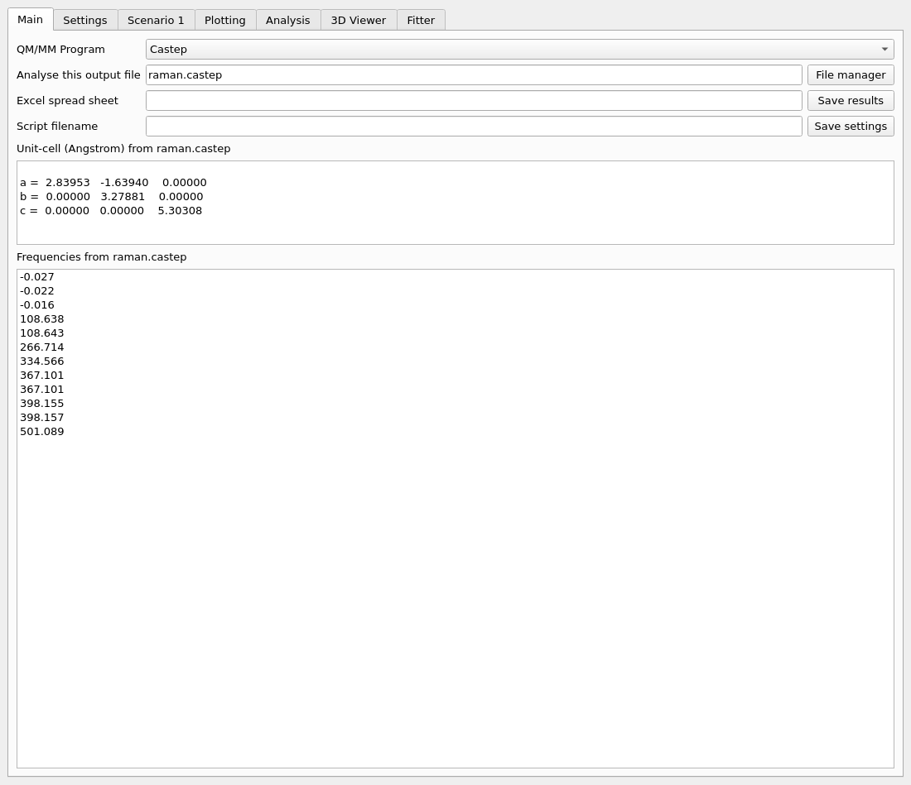

   The Main Tab for the ZnO calculation.

Choose the *QM/MM Program* from Abinit, Aims, Castep, Crystal, Experiment,
Finite_field, Gulp, Phonopy, Quantum Espresso, Vasp or PDGui. Enter the output
filename in *Analyse this output file*, or select it with *File manager*.
The *PDGui* choice reads a saved Python session. Some readers also use files
beside the selected output, so keep the calculation's companion files together.

*Experiment* reads material descriptions in the :ref:`experimental-file-format`.
*Finite_field* reads the consolidated :ref:`finite-field-json-format`, including
results from finite-difference workflows. These are material inputs; the
experimental spectrum used for fitting is selected in the Fitter Tab.

*Excel spread sheet* sets the ``.xlsx`` destination. *Save results* writes the
calculated results and settings. *Script filename* sets the Python file written
by *Save settings*. Reload that file to reproduce the session; the calculation
input and any materials database referenced by it must still be available.

The lower text areas report the unit-cell vectors in Angstrom and the
frequencies read from the input. They are outputs, not editable model
parameters. Frequencies after mass changes and other corrections are shown in
the Settings Tab.

Settings Tab
============

The *Settings Tab* controls the spectroscopy and the common vibrational data
used by every scenario.

.. _fig-settingsTab:

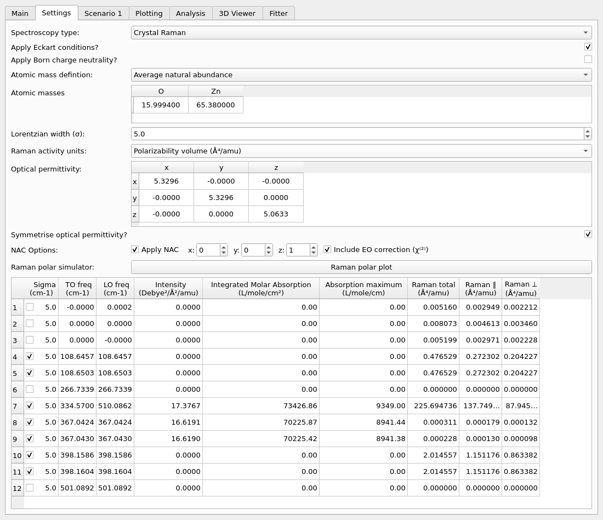

   The Settings Tab with NAC and EO diagnostics enabled for ZnO.

*Spectroscopy type* selects *Powder Infrared*, *Powder ATR*, *Powder Raman*,
*Crystal Infrared* or *Crystal Raman*. Changing it replaces the scenarios with
one scenario of the selected type. Save a session before changing spectroscopy
if the existing scenarios will be needed again.

*Apply Eckart conditions?* projects out the three translational modes of the
dynamical matrix and is on by default. *Apply Born charge neutrality?* removes
the sum of the Born-charge tensors and is off by default. These controls
require the corresponding data from the reader.

*Atomic mass definition* offers average natural-abundance masses (the default),
program masses, most-common-isotope masses or individually entered masses.
The *Atomic masses* table is editable and uses amu. With a dynamical matrix,
changing masses recalculates modes and frequencies. The input-format reference
explains the limitations when only precomputed modes or Raman tensors are
supplied.

*Lorentzian width (σ)* sets the common half-width at half maximum in |cm-1|,
initially 5. Individual mode widths can be changed in the lower table. The
*Optical permittivity* table contains the dimensionless electronic background
tensor. Edit its elements when a value must be supplied or replaced.
*Symmetrise optical permittivity?*, on by default for electronic-structure readers, averages it over the crystal
point group. Experimental input leaves this off by default. Reading a new input resets input-dependent masses and permittivity.

For Raman calculations, *Raman activity units* chooses polarizability-volume
activities in Angstrom⁴/amu or activities in the internal
:math:`R_\epsilon` convention in Angstrom/amu. This changes the displayed
activities, not the physical normalisation of the tensors used by scenarios.

The *NAC Options* row controls the mode-table diagnostics. *Apply NAC* fills
the LO-frequency column using the direction specified by x, y and z in the
crystal Cartesian frame; initially it is off and the direction is (0, 0, 1).
Use a non-zero direction. *Include EO correction* adds the nonlinear response
to the diagnostic Raman tensors when the required data are present. It is
initially off. These controls are separate from *Layer NAC mode* and *Include
electro-optic term* in a Crystal Raman scenario. *Raman polar plot* opens the
:ref:`raman-polar-window`.

The lower table has one row per mode. The checkbox beside *Sigma* determines
whether the mode contributes to subsequent spectra; greyed values indicate
unselected modes. The columns show TO frequency, optional LO frequency, IR
intensity in Debye²/Angstrom²/amu, integrated molar absorption, absorption
maximum, and total, parallel and perpendicular Raman activities where present.
The headers give the units. The IR quantities and the Raman activities are
different measures of response; a Raman-active mode can have zero IR intensity.

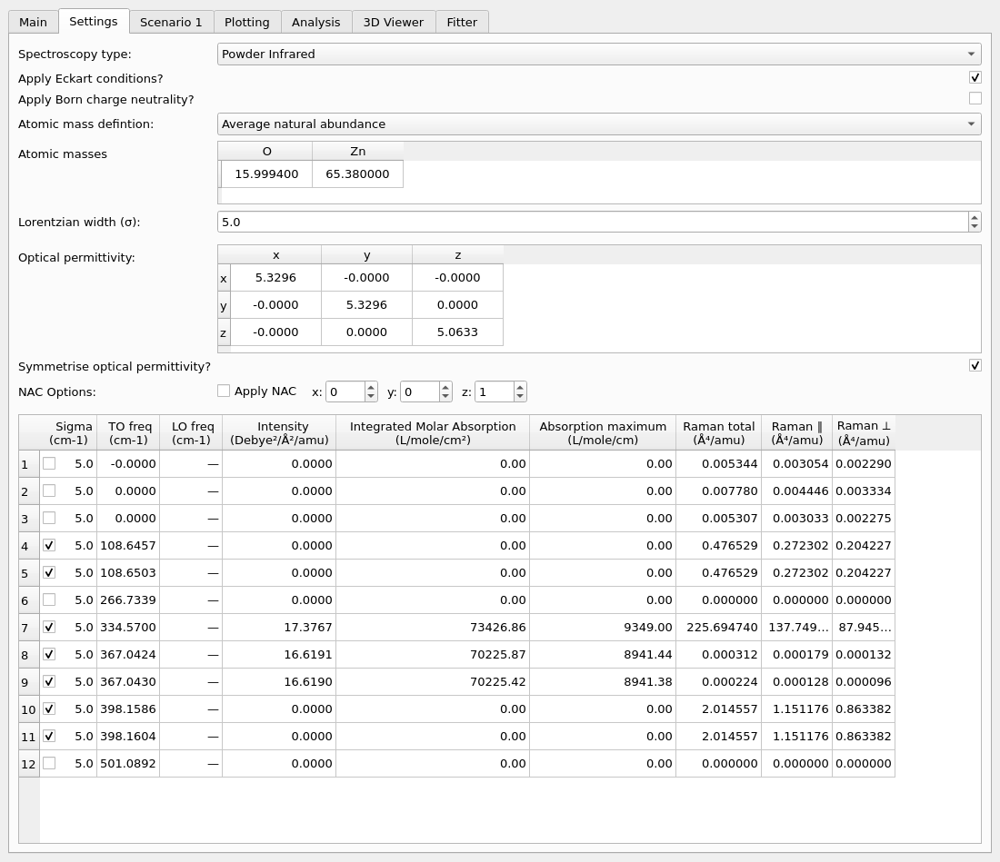

   The same input with Powder Infrared selected. Raman-specific controls are hidden.

Scenario Tabs
=============

A scenario defines the sample and measurement conditions. *Add another
scenario* copies the current scenario, allowing one variable to be changed for
comparison. *Delete this scenario* removes it. The *legend* field names its
curve in plots. All scenarios in a session use the spectroscopy selected in
the Settings Tab; use that tab to change the spectroscopy.

Powder Infrared and ATR Scenarios
---------------------------------

A powder scenario describes crystallites dispersed in a supporting material.
The particle shape and the permittivities determine the effective optical
response.

.. _fig-scenarioTab-Powder:

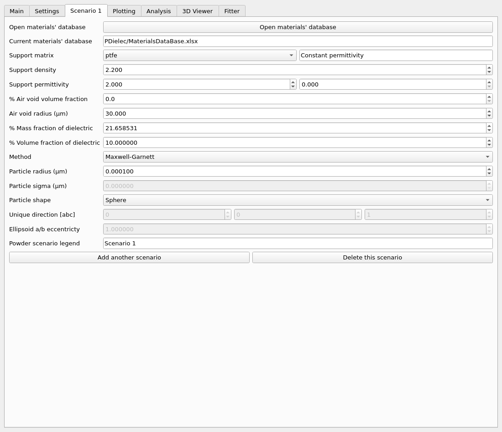

   The Powder Infrared scenario, using the default PTFE support.

*Open materials' database* selects an Excel materials database; the following
line reports the current file. *Support matrix* selects an entry. Its adjacent
read-only description reports the kind of dielectric model and, for tabulated
entries, the frequency range. *Support density* is in g/cm³. *Support
permittivity* shows real and imaginary parts. Editing supported matrix values
creates a manual description; frequency-dependent database entries should be
used within their stated range.

The mass and volume fractions are displayed as percentages. Editing one
recalculates the other using the material densities. They describe the amount
of dielectric crystallite in the mixture. *% Air void volume fraction* and
*Air void radius* describe additional air inclusions; the radius is in µm.
The air-void fraction defaults to zero.

*Method* selects Maxwell-Garnett (default), Bruggeman, Averaged Permittivity
or Mie. The first two are effective-medium treatments, Averaged Permittivity
averages the response, and Mie includes finite-size spherical scattering.
*Particle radius* and *Particle sigma* are in µm; the latter describes the
size-distribution parameter, not the Lorentzian mode width. Their availability
depends on the method. Use a small-particle effective-medium treatment only
where its assumptions apply; see :doc:`theory_powder`.

*Particle shape* offers Sphere, Needle, Plate and Ellipsoid. A sphere needs no
orientation. A needle or ellipsoid uses *Unique direction [abc]* for its axis;
a plate uses the corresponding (hkl) surface normal. *Ellipsoid a/b* is the
axial aspect ratio, with one giving a sphere. Direction and ratio controls
are enabled only for the relevant shape.

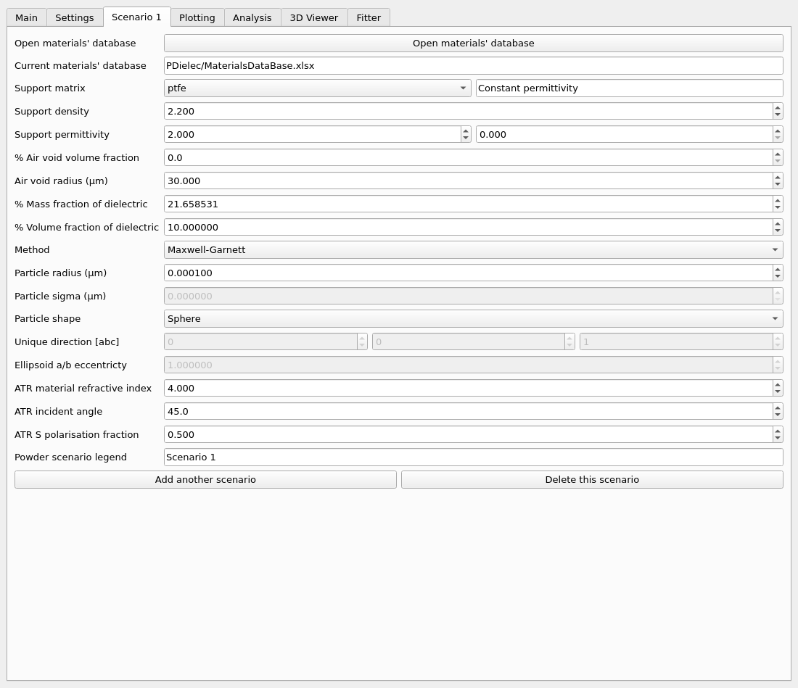

   The Powder ATR scenario adds the measurement geometry.

The *Powder ATR* choice adds the ATR-material refractive index, the incident
angle in degrees, and the s-polarisation fraction. A fraction of zero is pure
p polarisation, one is pure s, and 0.5 is an equal mixture. These controls
specify the ATR optical geometry; they do not change the particle orientation.
See :ref:`ATR_theory` for the calculation.

Crystal Infrared Scenarios
--------------------------

A crystal scenario describes a stack of planar layers between a superstrate
and substrate. The *Dielectric layer* uses the calculation loaded in Main;
other materials are selected from the database.

.. _fig-scenarioTab-SingleCrystal:

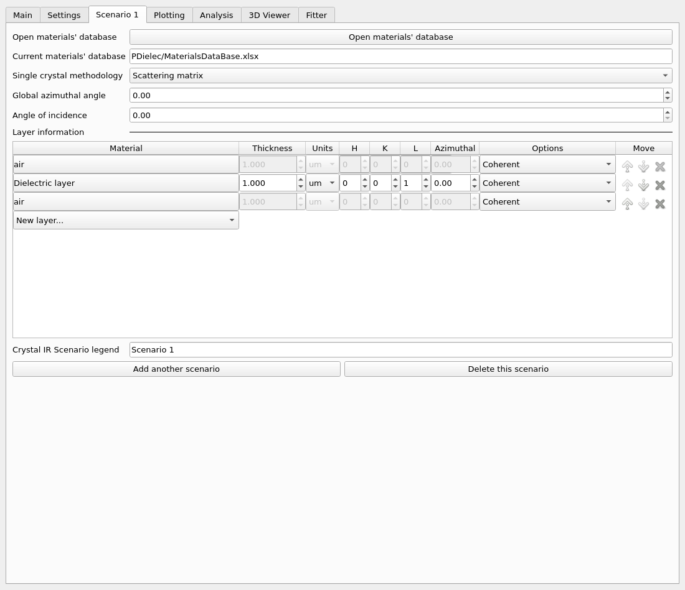

   The Crystal Infrared scenario for air / ZnO / air.

*Single crystal methodology* selects Transfer matrix or Scattering matrix.
The default Scattering matrix is useful for avoiding numerical problems with
strongly absorbing or thick layers. *Global azimuthal angle* rotates the stack
about its surface normal; *Angle of incidence* measures the incoming beam
from that normal. Both angles are in degrees and initially zero.

Under *Layer information*, each row represents a layer. *Material* opens the
layer editor. *Thickness* and *Units* set the finite-layer thickness; the
semi-infinite superstrate and substrate do not have an editable optical
thickness. H, K and L specify the crystalline surface normal, and *Azimuthal*
rotates that layer about the normal. These orientation fields do not apply to
isotropic materials.

*Options* selects the layer's optical coherence treatment. *Coherent* retains
phase interference; *Incoherent (intensity)* combines intensities,
*Incoherent (phase averaging)* averages optical phases, and
*Incoherent (non-reflective)* describes a thick non-reflective medium. These optical options are distinct from Raman depth and layer coherence.
The up/down arrows move a layer within the stack; the cross deletes it.
*New layer...* adds a material selected from the database. Check the layer
order after making changes.

.. _the-layer-editor:

The Layer Editor
................

Press a *Material* button to edit the corresponding layer.

.. _fig-layer-editor-window:

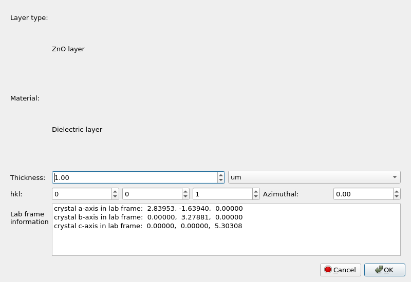

   The layer editor for crystalline ZnO.

*Layer type* and *Material* identify the layer being edited. *Thickness* and
its unit selector describe the finite layer. For a crystal, hkl and
*Azimuthal* set the surface and rotation. The *Lab frame information* output
shows the lattice vectors in laboratory coordinates and their relation to
the surface. It is not a second set of editable lattice parameters.

The laboratory Z-axis is normal to the surface and the incidence plane is XZ.
p-polarised light lies in this plane; s-polarised light is perpendicular to it.
The relationship is described in :ref:`crystal-and-laboratory-coordinates`.
*OK* accepts the layer changes and *Cancel* discards them.

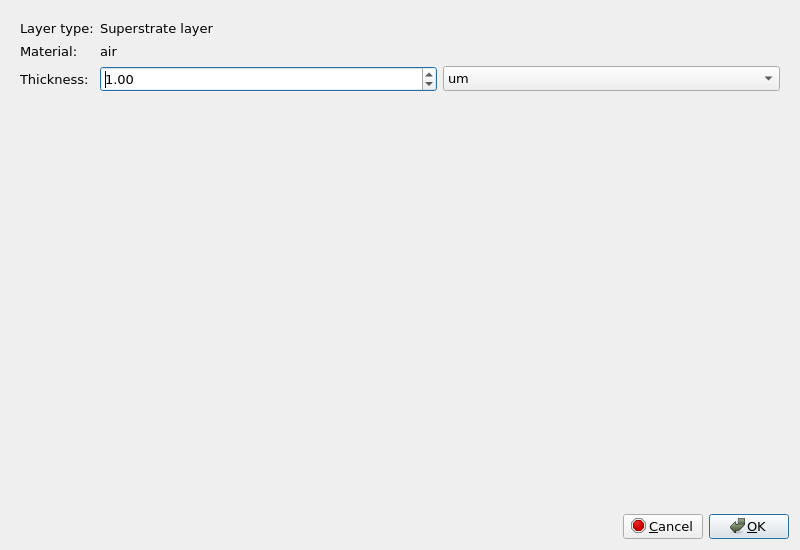

   An isotropic material does not require crystallographic orientation controls.

.. _powder-raman-gui:

Powder Raman Scenarios
----------------------

The *Powder Raman* scenario averages scattering over crystallite orientations
and includes the particle's local optical fields. It requires Raman tensors
from the loaded calculation. The theory is described in
:ref:`Powder-Raman-Theory`.

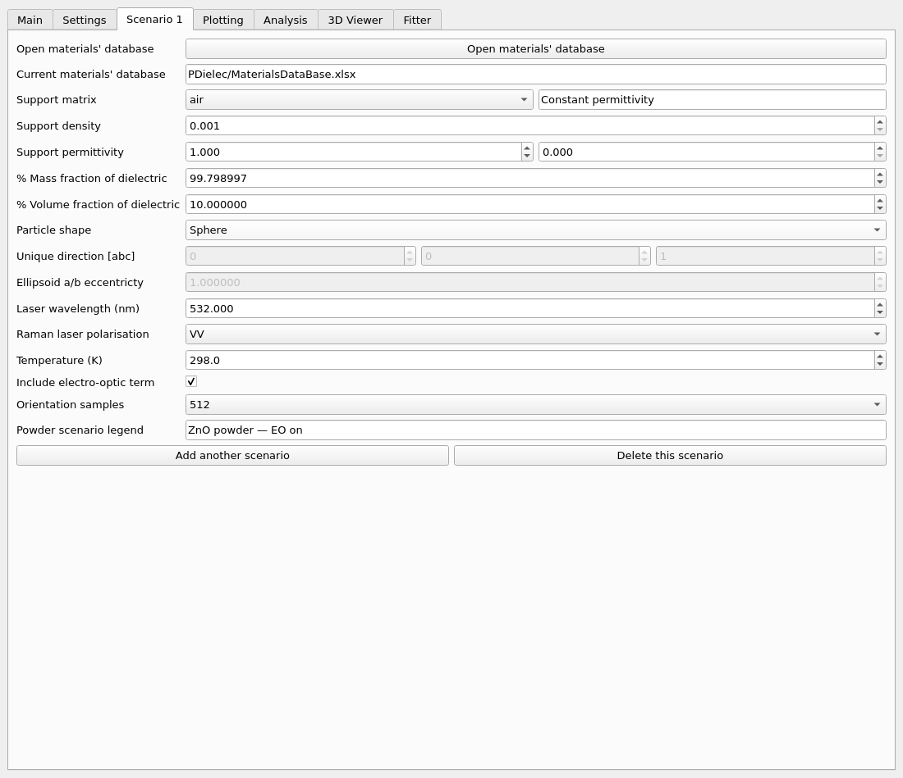

   ZnO spheres in air with the EO correction enabled.

The database, support material, density, complex permittivity, mass/volume
fractions and particle-shape controls have the meanings given for powder
infrared scenarios. The example uses 10% volume fraction. *Laser wavelength*
is in nm, initially 785; the figures use 532. *Raman laser polarisation*
selects VV (parallel, the default), VH or HV (crossed), or Unpolarised.
*Temperature* is in K, initially 298, and determines the thermal population
factor.

*Include electro-optic term* adds the finite-particle EO contribution to the
Raman tensors using the particle's depolarisation field. It is off by default
and explicitly enabled here. The input must contain nonlinear susceptibility
as well as the response needed for the particle phonon correction. Enabling
the checkbox cannot supply missing data. The CASTEP ZnO example contains this
response, and switching EO off gives a different spectrum.

*Orientation samples* selects the number of numerical orientations for
non-spherical particles, from 4 to 4096, initially 512. Increase it to check
convergence of an anisotropic particle average. Spheres do not need this
numerical sampling. Particle shape can affect both the mode frequencies and
the Raman response, so a change in shape is not simply a rescaling of peaks.

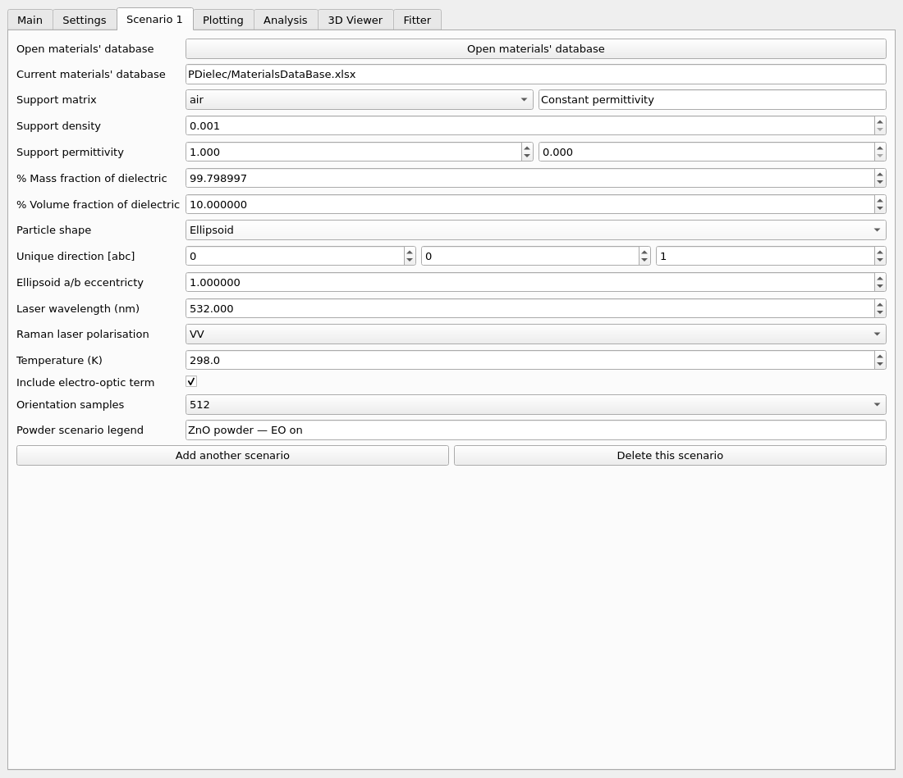

   Selecting Ellipsoid enables the unique-axis and aspect-ratio controls.

.. _crystal-raman-gui:

Crystal Raman Scenarios
-----------------------

The *Crystal Raman* scenario calculates laser and reciprocal scattered fields
in a layered sample and combines them with the Raman tensors. The common
optical method and incidence controls are followed by Raman controls, the
layer table, and the azimuthal sweep controls at the bottom.

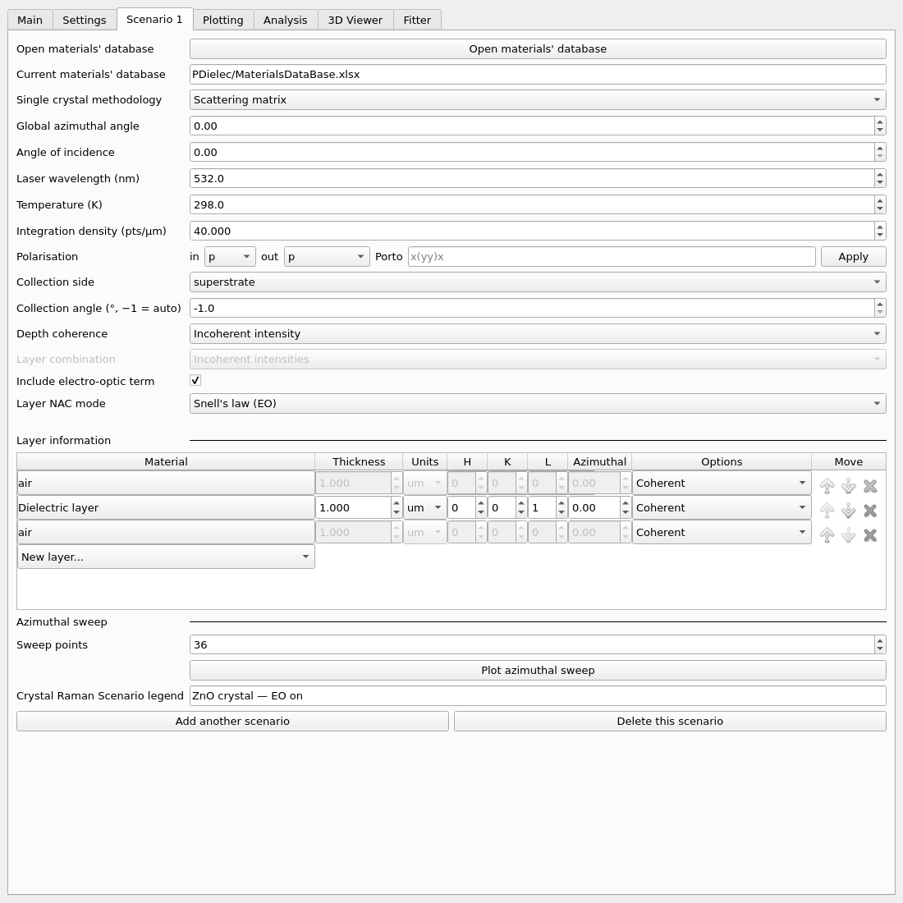

   A 1 µm ZnO layer with p/p backscattering and Snell's law (EO).

*Laser wavelength* is in nm (default 532) and *Temperature* is in K (default
298). *Integration density* sets the depth quadrature density in points/µm.
The default is 20 and the example uses 40; doubling it to 80 changes this spectrum negligibly.
Convergence depends on the layer thickness and optical fields, so check it
for a different sample.

*Polarisation* contains the incident (*in*) and detected (*out*) choices.
The defaults are p/p; s is perpendicular to the incidence plane and
Unpolarised detection sums the two detector channels as intensities.
Alternatively enter *Porto* notation and press *Apply*. This sets a
normal-incidence geometry, surface direction and polarisations; the selectors
then show *porto*. For example, ``x(yy)-x`` denotes backscattering with y-in/y-out.
The common shorthand ``x(yy)x`` is also interpreted as backscattering;
``x(yy)+x`` explicitly requests forward scattering. Compound polarisations use
comma-separated expressions, for example ``z(x+y,x+y)z``.

*Collection side* chooses superstrate (backscattering, default) or substrate
(forward scattering). *Collection angle* is in degrees. The default −1 is
automatic: retro-backscattering on the superstrate side or collinear forward
scattering on the substrate side. An explicit angle equal to the incidence
angle specifies specular reflection. The distinction matters at oblique
incidence.

*Depth coherence* selects Coherent amplitude or Incoherent intensity. The
former adds amplitudes through a layer before squaring; it requires an
appropriate phase-coherent phonon model. The latter integrates local
intensities. *Layer combination* separately specifies Incoherent intensities
or Coherent amplitudes between active layers. Incoherent depth forces
incoherent layer combination and disables that selector. The default depth choice is Coherent amplitude and the default layer
combination is Incoherent intensities. The introductory example uses
incoherent intensity at both levels. Thin optical layers alone
do not establish coherent spontaneous Raman emission.

*Include electro-optic term* is on by default for crystal Raman. It uses the
input nonlinear susceptibility to correct the Raman tensor of a polar mode.
The *Layer NAC mode* chooses the phonon-frequency treatment:

.. list-table:: Layer NAC choices
   :header-rows: 1
   :widths: 1 3

   * - Choice
     - Meaning
   * - TO
     - Use bulk transverse-optic frequencies without the polar correction.
       The EO term is not applied in this mode.
   * - Snell's law
     - Use the macroscopic scattering geometry to determine the phonon
       wavevector for the non-analytic correction. This is the default.
   * - Dominant mode
     - Use the dominant internal optical eigenmode to determine that direction.
   * - All modes
     - Resolve incident/scattered internal propagation-channel pairs, allowing
       more than one corrected frequency for an original TO mode.

The last three choices acquire an *(EO)* suffix when the nonlinear response
is available and the EO option is enabled. The selected example therefore
shows *Snell's law (EO)*. These phonon corrections are separate from solving
optical propagation with the transfer/scattering matrix. See
:ref:`Crystal-Raman-Theory` for the assumptions and equations.

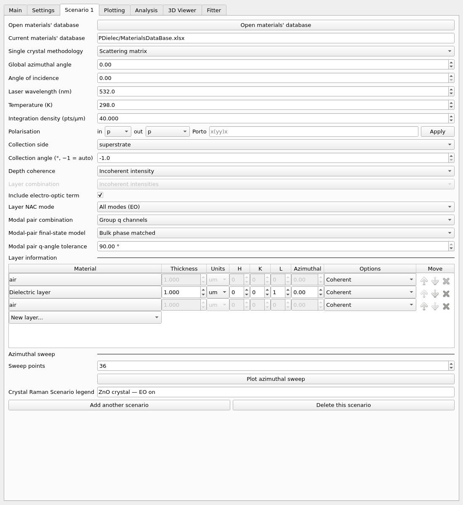

   The additional controls shown for All modes (EO).

*Modal pair combination* offers Group q channels (default), Incoherent pairs
and Coherent all pairs. Group q channels combines amplitudes for the same
phonon final state before summing intensities over different states. The other
two choices are diagnostic alternatives. *Modal-pair final-state model*
distinguishes Bulk phase matched from Local incoherent for incoherent-depth,
grouped-q calculations. In the bulk model *Modal pair q-angle tolerance*,
initially 90°, controls the accepted directions relative to the external
momentum transfer. It is inactive for Local incoherent. Controls are enabled
only where their combination is meaningful; a hidden All modes control does
not change the Snell's-law calculation.

The layer-table columns and editor are shared with Crystal Infrared. Raman
response comes from the active dielectric layer; a database optical material
does not acquire Raman tensors merely by being inserted into the stack.

Under *Azimuthal sweep*, *Sweep points* specifies equally spaced angles over
0–360°, excluding the repeated endpoint, initially 36. *Plot azimuthal sweep*
calculates the selected geometry at those angles and opens the
:ref:`azimuthal-sweep-window`. Run a spectrum first to define the frequency
axis. Each new sweep opens a separate result window.

Plotting Tab
============

The *Plotting Tab* displays the calculated scenarios together.

.. _fig-plottingTab-Powder:

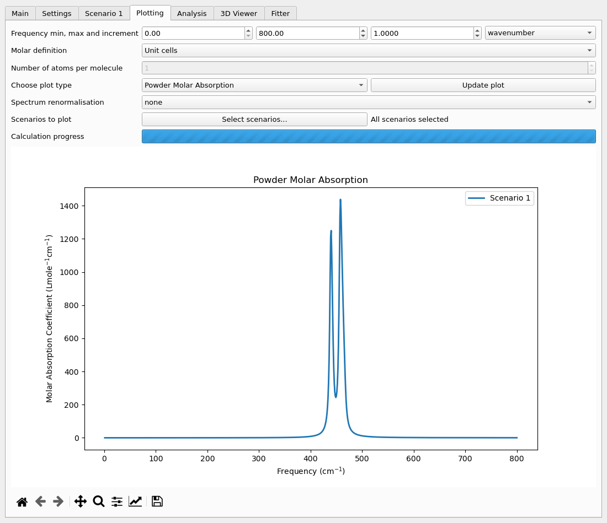

   The Plotting Tab for Powder Infrared.

*Frequency min, max and increment* set the calculation grid. The adjacent
unit selector offers wavenumber, THz, GHz and wavelength units from Angstrom
to metres. Zero is not a valid wavelength. For Raman, use wavenumber to show
Raman shifts unambiguously. A sufficiently small increment is needed to
resolve narrow peaks.

*Molar definition* chooses Unit cells, Atoms or Molecules for molar absorption;
*Number of atoms per molecule* supplies the molecular conversion. These
controls do not set the normalisation of a Raman tensor. *Choose plot type*
offers quantities appropriate to the spectroscopy: powder absorption or
permittivity, ATR response, crystal reflectance/transmittance/absorptance,
or Raman intensity.

*Spectrum renormalisation* offers none, max=1 and area=1. Crystal Raman also
offers layer depth to divide by active-layer depth. Use none when comparing
absolute calculated scales between scenarios; independently normalising curves
can obscure an EO or thickness effect. Raman intensities are reported in
arbitrary units, not calibrated experimental cross sections.

.. _fig-plottingTab-SingleCrystal:

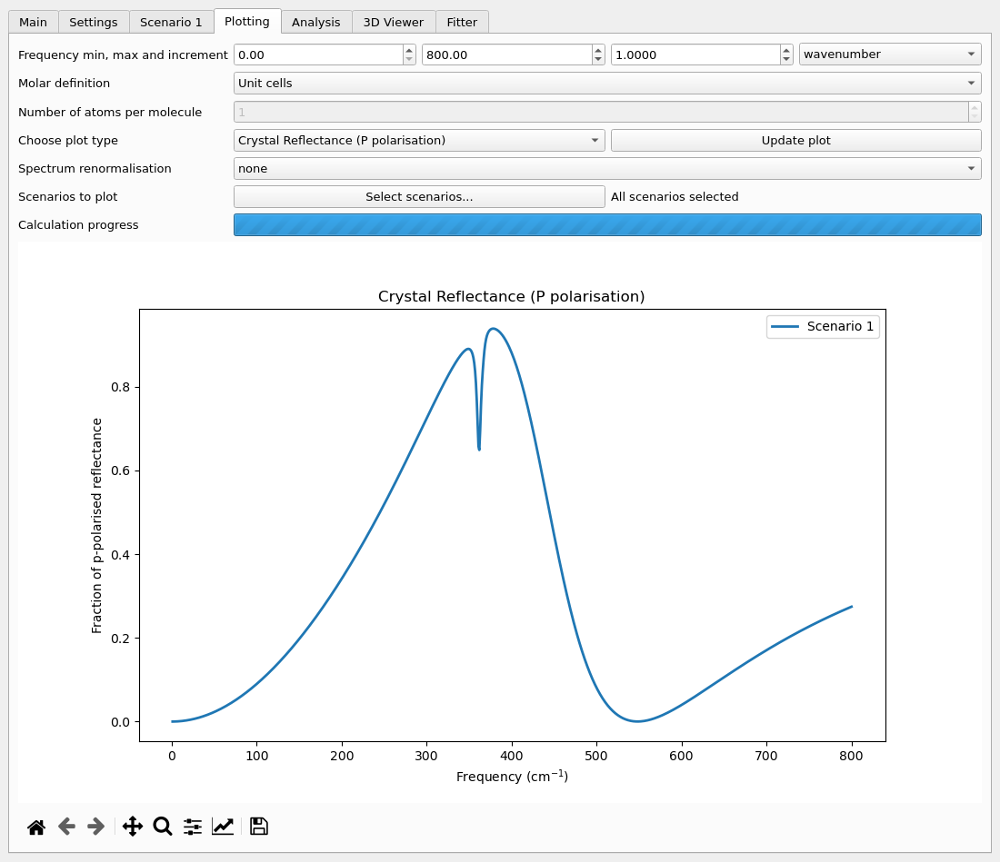

   The Plotting Tab for Crystal Infrared.

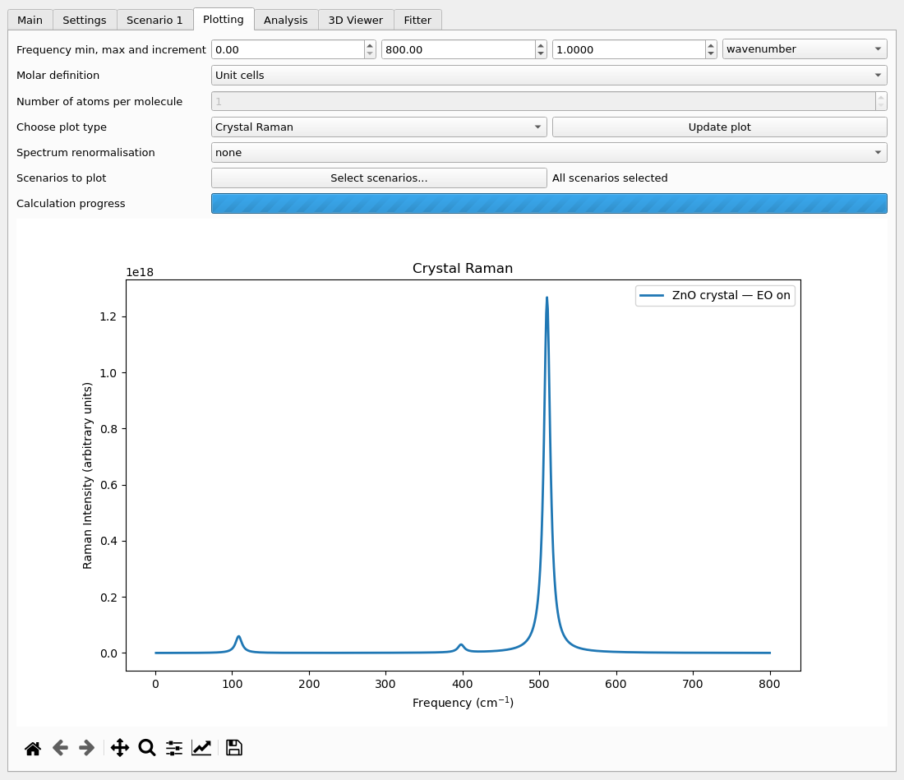

   The ZnO Crystal Raman spectrum with EO enabled.

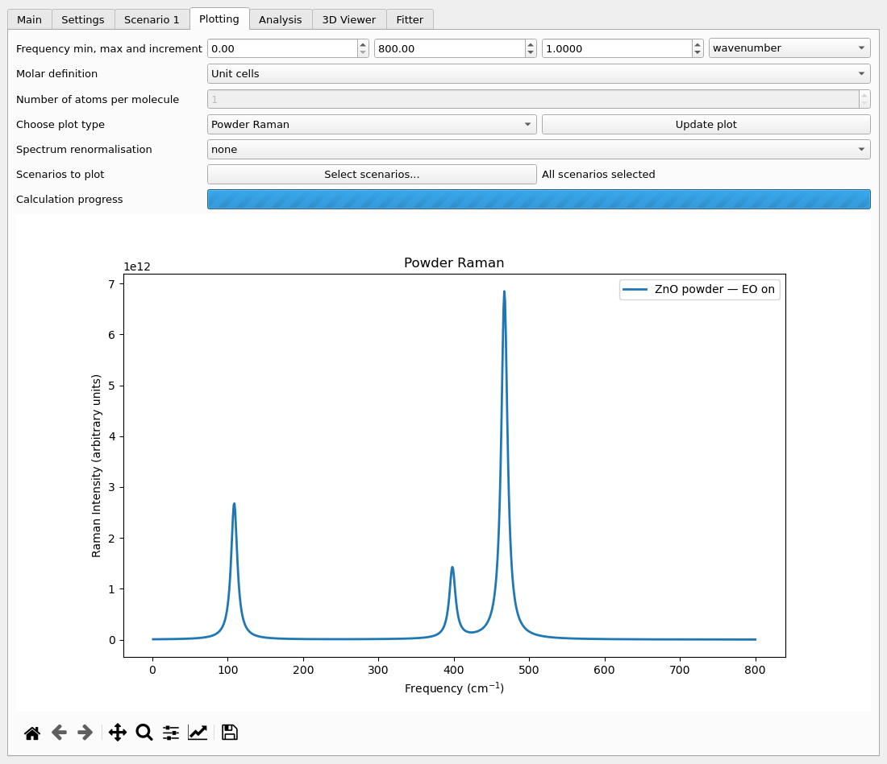

   The corresponding Powder Raman spectrum.

*Select scenarios...* opens a table with a *Plot* checkbox, scenario number
and legend for each scenario. *OK* applies the selection; *Cancel* keeps it.
The text beside the button reports how many are selected. *Update plot*
refreshes the calculations and figure, with *Calculation progress* reporting
completion. The Matplotlib toolbar provides Home, back/forward view history,
pan, zoom, subplot/curve configuration and image saving; these are display
operations and do not change the scenario physics.

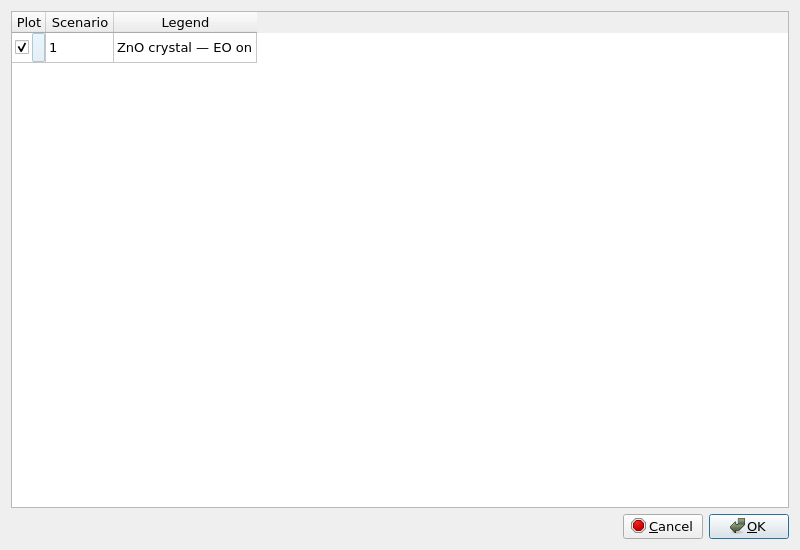

   Choosing which scenarios appear in the plot.

Analysis Tab
============

The *Analysis Tab* decomposes normal-mode motion into internal and external
components or molecular contributions. It needs atomic positions and normal
modes, rather than a permittivity-only input.

.. _fig-analysisTab:

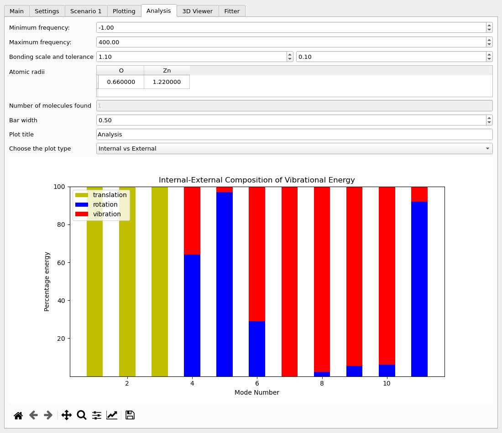

   The Analysis Tab for ZnO.

*Minimum frequency* and *Maximum frequency* select modes in |cm-1|.
*Bonding scale and tolerance* identify connected atoms using a distance cutoff
of scale × (radius i + radius j) + tolerance; tolerance and *Atomic radii*
are in Angstrom. The defaults are scale 1.1 and tolerance 0.1. Edit the
individual radii in the table where a different bonding description is needed.
*Number of molecules found* is an output of that connectivity analysis. In an
extended crystal a connected group should not automatically be interpreted
as an isolated molecule.

*Bar width* (default 0.5) controls the appearance of the bars and *Plot title*
sets the heading. *Choose the plot type* switches between Internal vs External
and Molecular Composition. Neither option changes the phonon frequencies.
The figure toolbar has the same navigation and saving actions as Plotting.
See :doc:`analysis` for the interpretation of the decomposition.

3D Viewer Tab
=============

The *3D Viewer* displays atomic structure and phonon displacements using the
bonding information from Analysis.

.. _fig-viewerTab:

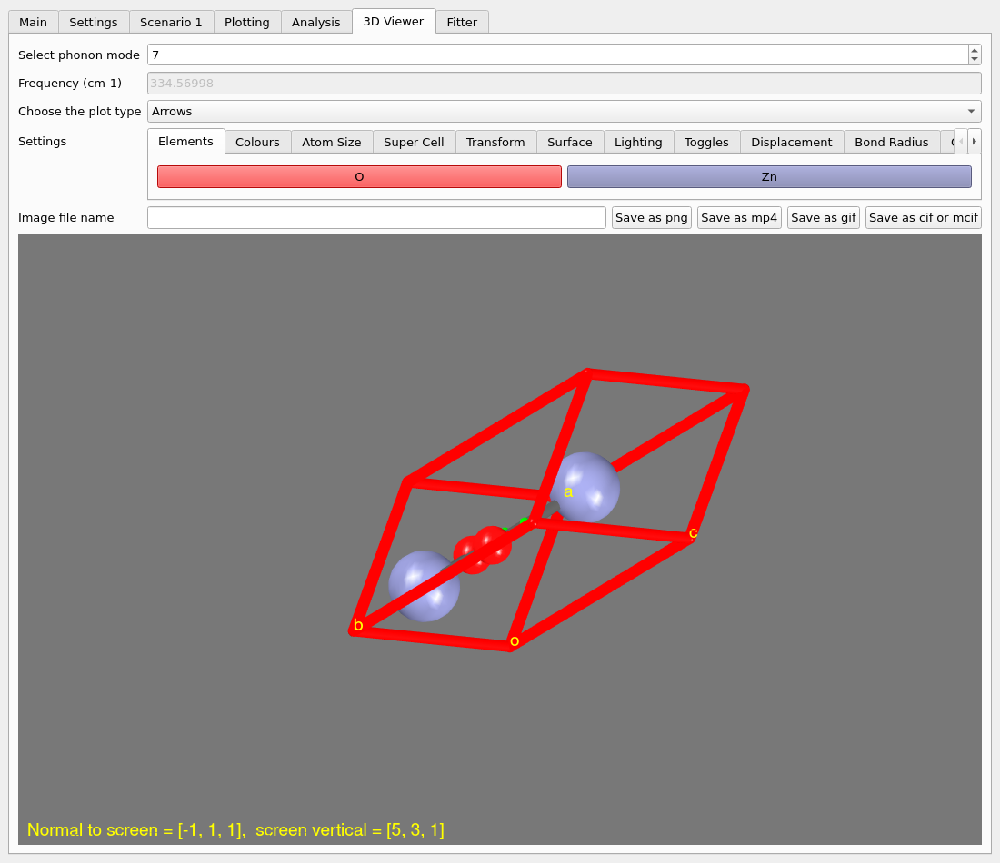

   The 3D Viewer showing a ZnO phonon.

*Select phonon mode* selects a numbered mode; the disabled *Frequency* box
reports its frequency in |cm-1|. *Choose the plot type* selects Animation,
Arrows or No arrows or animation. Mouse movement and the wheel
rotate and magnify the view. The *Settings* strip contains the following tabs;
use its arrows to reach those outside the available width.

.. list-table:: Viewer settings
   :header-rows: 1
   :widths: 1 3

   * - Tab
     - Description
   * - Elements
     - Element buttons open colour selectors for the atomic spheres.
   * - Colours
     - Separate colours for background, cell outline, bonds and displacement arrows.
   * - Atom Size
     - Scale factor multiplying the covalent radii for displayed sphere sizes.
   * - Super Cell
     - Integer repetitions along a, b and c of the original DFT cell.
   * - Transform
     - Open the cell-transformation matrix editor described below.
   * - Surface
     - hkl chooses a surface normal and uvw an in-plane direction for the view.
   * - Lighting
     - Switch light sources 0–7 on or off.
   * - Toggles
     - Turn cell labels, the cell outline, the orientation indicator, bonds
       and atoms on or off using the selector.
   * - Displacement
     - Maximum displayed phonon displacement; controls visual scale, not a
       thermal displacement amplitude.
   * - Bond Radius
     - Radius of displayed bond cylinders in Angstrom.
   * - Cell Radius
     - Radius of the cell-outline cylinders in Angstrom.
   * - Arrow Radius
     - Radius of displacement arrows in Angstrom.

*Image file name* supplies the output path. *Save as png* writes a still image;
*Save as mp4* and *Save as gif* write animation; *Save as cif or mcif* exports
the structure or mode information according to the extension. These are
outputs of the viewer, not replacements for the calculation input.

.. _viewer-transform-window:

The Transformation Window
-------------------------

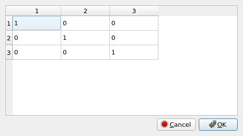

   The cell-transformation editor.

Each row of the 3 by 3 table gives a new lattice vector as a linear
combination of the old lattice vectors. The identity matrix leaves the cell
unchanged. Entries accept numerical expressions such as fractions. *OK*
accepts the transformation and *Cancel* discards it. The viewer transformation
changes the displayed cell, not the DFT calculation that supplied the modes.

Fitter Tab
==========

The *Fitter Tab* compares a calculated scenario with an experimental spectrum
and can adjust selected linewidths and an optional frequency scale.

.. _fig-fitter:

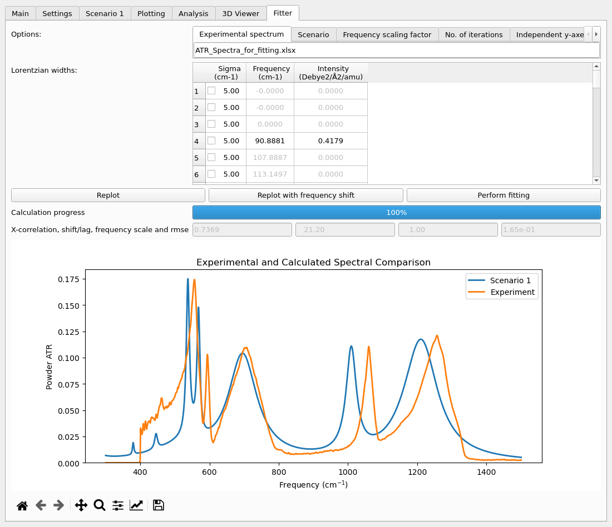

   The existing sodium-sulphate ATR fitting example.

The *Options* tabs provide the controls below. The experimental file is an
``.xlsx`` spreadsheet or ``.csv`` file with frequency in |cm-1| in the first
column and measured signal in the second, with at most one heading row.
This is distinct from an *Experiment* material file. The example uses
``Examples/ATR/Na2SO42_fit/ATR_Spectra_for_fitting.xlsx`` and its matching
calculation; it does not use an invented ZnO experimental spectrum.

.. list-table:: Fitter options
   :header-rows: 1
   :widths: 1 3

   * - Tab
     - Description
   * - Experimental spectrum
     - Path of the measured data. Press Return after entering it to read it.
   * - Scenario
     - Select the calculated scenario to compare. Its plotted quantity must
       match the experimental signal.
   * - Frequency scaling factor
     - Multiplier for calculated frequencies, initially 1.0.
   * - No. of iterations
     - Optimisation iteration limit, initially 20.
   * - Independent y-axes
     - Use separate scales for calculated and experimental signals; initially
       on. Inspect the scales before comparing peak heights.
   * - Fitting type
     - Minimise x-correlation maximises the correlation through its objective;
       Minimise spectral difference minimises the spectral error.
   * - Optimise scaling
     - Include the frequency scaling factor in optimisation; initially off.
   * - Spectral difference threshold
     - Signal threshold for the spectral-difference objective, initially 0.05.
   * - Baseline removal?
     - Apply baseline correction to the experimental data; initially off.
   * - HP Filter Lambda
     - Base-10 logarithm of the Hodrick-Prescott filter parameter, initially 7.

In *Lorentzian widths*, edit sigma values in |cm-1| and check those to include
in the fit. Frequency and intensity columns identify the transitions; they
are not independent fitted parameters. *Replot* recalculates the comparison.
*Replot with frequency shift* additionally applies the lag that maximises the
cross-correlation. *Perform fitting* starts optimisation and changes to an
interrupt control while running. The progress bar reports calculation progress.

The four read-only diagnostics are cross-correlation, shift/lag in |cm-1|,
frequency scale and root-mean-square error. Inspect the resulting spectrum
as well as these numbers. The fitting uses the frequency range from Plotting;
its toolbar controls the view and exports images.

.. _raman-polar-window:

Raman Polar Window
==================

The *Raman polar plot* button in Settings opens a tensor-level polarisation
simulator. It is useful for examining selection rules without constructing
an optical layer stack.

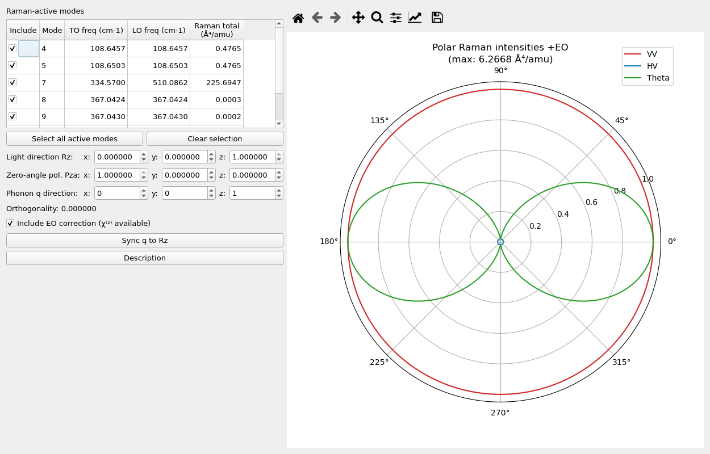

   The ZnO Raman polar simulator with the nonlinear response available.

The *Raman-active modes* table contains an Include checkbox, mode number, TO
frequency, LO frequency when NAC data are available, and total Raman activity
in the units chosen in Settings. *Select all active modes* and *Clear selection*
change the plotted set.

*Light direction Rz* gives the propagation/rotation axis and *Zero-angle pol.
Pza* the initial incident polarisation, both as Cartesian vectors. Pza should
be perpendicular to Rz; changing Rz adjusts Pza accordingly. The read-only
*Orthogonality* value is their dot product and should be zero.
*Phonon q̂ direction* independently sets the crystal-frame direction for the
LO and EO corrections. *Sync q̂ to Rz* copies the light axis, appropriate to
the backscattering approximation.

*Include EO correction (χ² available)* is shown when nonlinear response is
available and is initially checked. It is this window's own control, not the
scenario checkbox. The LO column likewise uses this window's phonon direction.
The three curves show parallel VV, crossed HV and a fixed-incident,
rotating-analyser geometry. They show tensor-level angular response, without
the scenario's layer interference or depth integration. The toolbar saves and
navigates the plot. *Description* explains the axes and geometries.

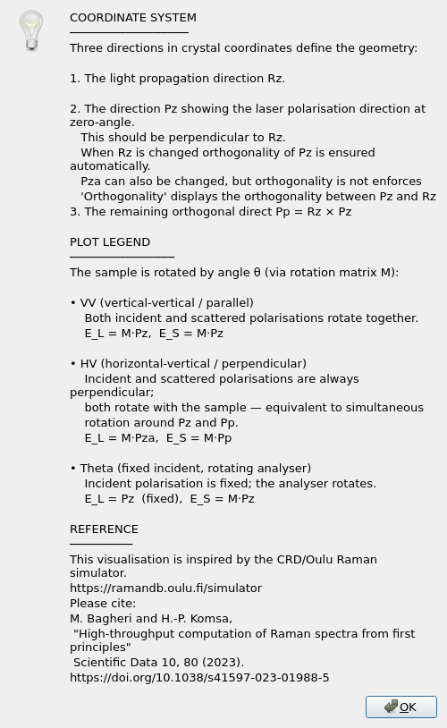

   The description window; close it to return to the simulator.

.. _azimuthal-sweep-window:

Azimuthal Sweep Window
======================

The Crystal Raman *Plot azimuthal sweep* button opens a result window using
the scenario's layer stack, optical fields, NAC and EO settings. This is a
different calculation from the tensor-level polar simulator.

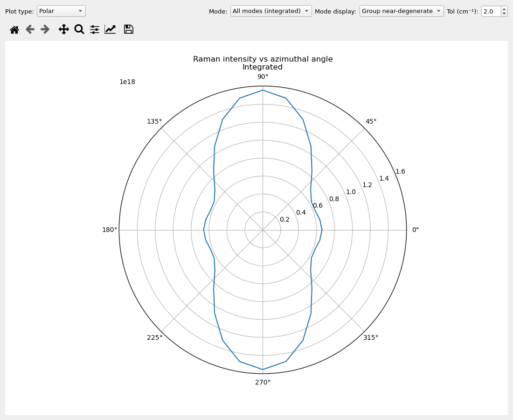

   A ZnO (100) azimuthal sweep with mode grouping enabled. This surface was
   chosen to show the variation under rotation, unlike the (001) main example.

*Plot type* offers Polar, Colour map, Waterfall and Line. *Mode* chooses an
individual mode or All modes (integrated). *Mode display* selects Individual
eigenmodes or Group near-degenerate. Grouping reveals *Tol (cm⁻¹)*, initially
2.0, which sets the frequency tolerance. Grouping sums the intensities of
nearly degenerate modes, avoiding an interpretation that depends on an
arbitrary choice of eigenvectors within a degenerate subspace.

Polar and Line show angular intensities. Colour map and Waterfall show the
spectral dependence across angles. Switching the plot presentation does not
rerun the scenario; to change physical settings, return to the scenario and
run a new sweep. The toolbar navigates and saves the figure.

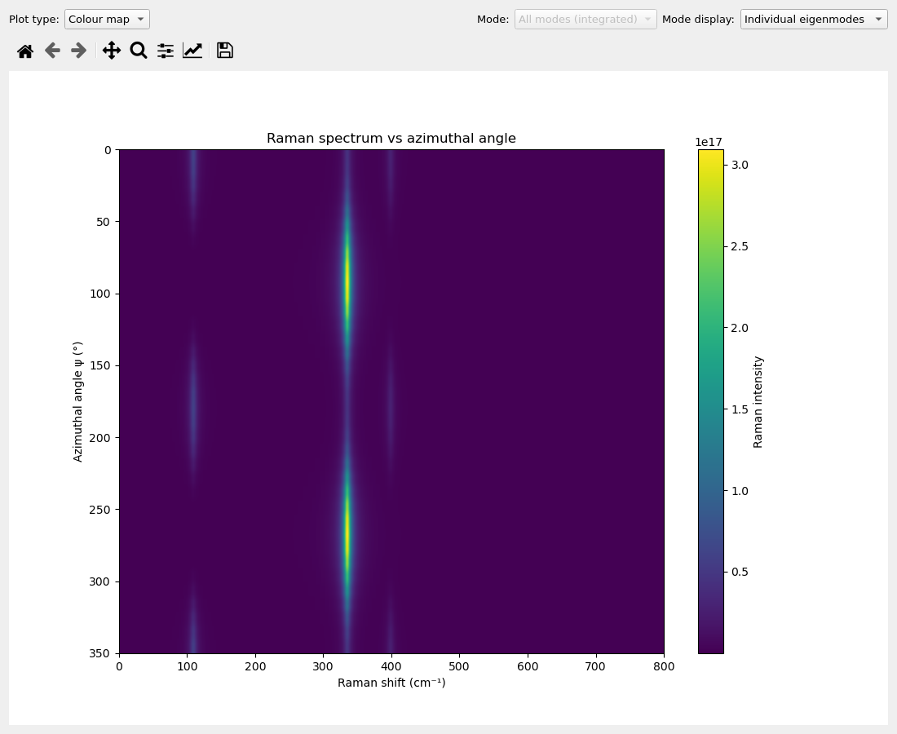

   The spectral colour-map view of the same sweep.

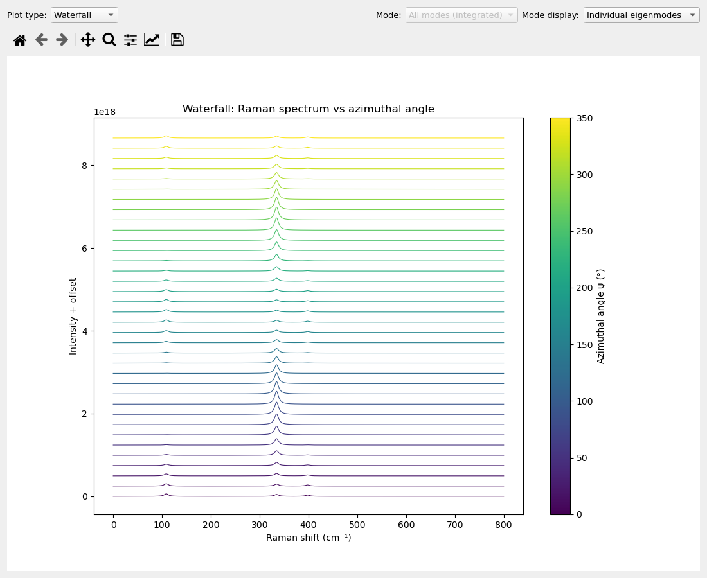

   The waterfall view.

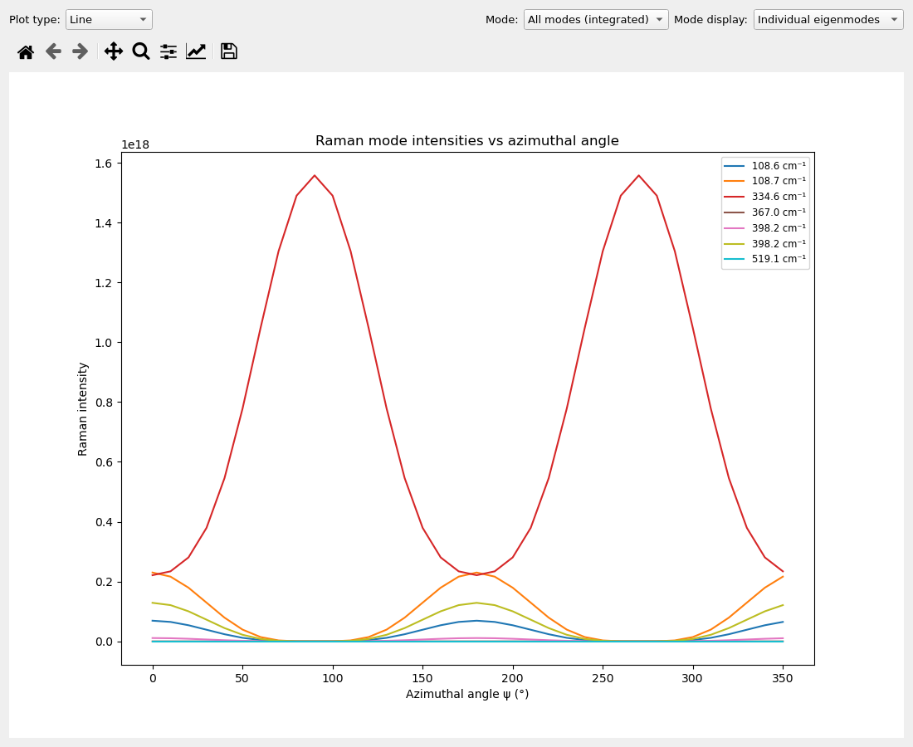

   The line view.

.. _pdgui-scripting:

Saving Settings and Scripting
=============================

*Save settings* on Main writes a Python session file. The script accesses the
notebook as ``self.notebook`` and the setting dictionaries of its tabs. A
saved session records the chosen data and options; the display-only controls
of auxiliary windows should be set in those windows when required.

Two advanced Crystal Raman settings are available through scripts while being
absent from the scenario GUI::

    tab = self.notebook.scenarios[0]
    tab.settings['Coalesce equivalent layers'] = True
    tab.settings['Approximate ES'] = False

*Coalesce equivalent layers*, default True, merges adjacent equivalent
coherent layers before Raman field integration. Disabling it is useful for
diagnosing artificial internal-boundary effects. *Approximate ES*, default
False, uses the laser field in place of separately evaluating the scattered
field when set True. It changes the optical approximation and should be
recorded when reporting results.

Script keys may retain older terminology: the powder Raman wavelength in nm
is stored as ``Raman laser frequency``. The crystal NAC selector uses
``Layer NAC mode`` values ``none``, ``geometry``, ``dominant_mode`` and
``modal_pairs`` for TO, Snell's law, Dominant mode and All modes respectively.
Use the saved script as the starting point rather than guessing visible-label
spellings. In an interactive script, request a refresh after changing settings.

.. _performance:

Performance
===========

PDGui can distribute calculations over worker processes. Use ``-cpus N`` to
limit the number of workers, and ``-threading`` where a thread-based worker
pool is needed. The environment variables ``PDIELEC_NUM_PROCESSORS``,
``PDIELEC_THREADING`` and ``PDIELEC_NUM_THREADS`` also configure parallelism.
Choose settings appropriate to the available memory and calculation size;
more workers need not make a small calculation faster.

Additional settings views
=========================

The following page shows each viewer and fitter settings tab separately, so
controls hidden by the tab strip in an overview remain visible.

.. toctree::
   :maxdepth: 1

   gui_options
