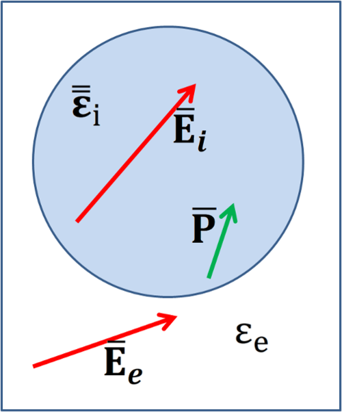

.. include:: preamble.txt

.. contents::
   :local:

======
Theory
======

The theory underlying the Python package PDielec is described.  PDielec calculates the infrared absorption characteristics of a crystalline material supported in a non-absorbing medium.  PDielec post processes solid state quantum mechanical and molecular mechanical calculations of the phonons and dielectric response of the crystalline material. The molecular and solid state quantum mechanical (QM) calculations of response properties such as the frequencies and intensities of infrared (IR) and terahertz (THz) radiation absorption has become generally available in many molecular and solid state computer programs. A common approach is to assume the harmonic approximation and calculate the mass weighted force constant matrix (for molecules) or the dynamical matrix at the gamma point (for periodic solids). Diagonalisation of the matrix gives the frequencies for absorption and the normal modes (molecules) or phonon displacements (periodic solids). The calculation of the absorption intensity for each mode requires the calculation of the change in dipole moment caused by the displacement of the atoms for that mode. For solids where there is a large separation of charge, there can be a large coupling between a phonon mode and the internal field within a particle resulting from its morphology. 

PDielec post processes the output of solid state quantum mechanical and molecular mechanics (MM) based codes such as VASP :cite:`Hafner2008c`, CASTEP :cite:`Clark2005d`, CRYSTAL :cite:`Dovesi2014`, Abinit :cite:`Gonze2016` , Quantum Espresso :cite:`Giannozzi2009`, Phonopy :cite:`Togo2015`, and GULP :cite:`Gale2003` to predict the infrared absorption of crystalline insulator materials whose crystal size is small compared with the wavelength of the absorbing radiation. The package is suited for the calculation of the complex, frequency dependent permittivity and its associated absorption of infrared radiation for a finely ground crystalline material dispersed in a low loss dielectric medium such KBr or Polytetrafluoroethylene (PTFE). A particular feature of the program is its ability to take into account the constant permittivity of the supporting medium and the particle shape of the material of interest through an effective medium theory. The paper outlines the theory used by the program and gives some examples of the application of the program for ionic and molecular materials.

Equations :eq:`eq-beer1` and :eq:`eq-beer2` describe Beer-Lambert's law :cite:`Bertie2006` where :math:`\alpha` is the (decadic) absorption coefficient (usually given in |cm-1|), :math:`I` and :math:`I_0` are the intensities after and before absorption respectively and :math:`d` is the path length.

.. math:: 
   :label: eq-beer1

   \frac{I}{I_{0}} = 10^{- \alpha d}

.. math::
   :label: eq-beer2

   log\left( \frac{I}{I_{0}} \right) = -\alpha d 

It is common, especially in the chemistry community, when reporting infrared spectra to use a decadic molar absorption coefficient (:math:`a`), which has units of |Lmol-1cm-1|. The relationship between the absorption coefficient and the molar absorption coefficient :cite:`Bertie2006` is;

.. math::
   :label: eq-aC

   \alpha = aC

where :math:`C` is the concentration of the absorbing species.

Molecular approach to absorption intensity
------------------------------------------

For molecules the transition intensity :math:`I_k` of the :math:`k^{th}` vibrational mode (calculated from the change in dipole moment along the mode displacement) can be converted to an integrated molar absorption coefficient, :math:`A_k`, which can then be more readily compared with experiment. The theory for this is described by Wilson, Decius and Cross :cite:`Wilson1955` and results in expressions such as those given in equations :eq:`eq-Absorption1` and :eq:`eq-Absorption2`.  The first expression shows the relationship between the integrated molar absorption coefficient and the transition intensity and uses the number of molecules per unit volume (:math:`N`), the velocity of light (:math:`c`) and the degeneracy of the mode (:math:`g_k`). The second expression shows the appropriate conversion factors if the units for the integrated molar absorption coefficient are |Lmol-1cm-2| (1 |Lmol-1cm-2| = 0.01 |kmmol-1|) and the units for the transition intensity are |D2A-2amu-1|, where D represents the Debye unit of dipole  moment and amu is an atomic mass unit. The factor :math:`log_e10` arises due to the choice of a decadic Beer's law.

.. math::
   :label: eq-Absorption1

    A_k =  \frac{N\pi}{3c^{2}\log_e10}g_kI_k

.. math::
   :label: eq-Absorption2

   A_k =  \frac{Na\pi}{3000c^{2}2.302585}g_kI_k  = 4225.6I_k

The derivation of the above expressions assumes that the rotational levels are not quantised and that the vibrational levels are thermally occupied according to a Boltzmann distribution. In order to use the calculated molecular intensities to predict a spectrum it is usual to assume :cite:`Wilson1955` that each transition is associated with a Lorentzian line shape with a full width at half maximum (FWHM) of :math:`\sigma_k`. It is common, when reporting comparison between theoretical and experimental spectra, to assume that the line widths are the same for all modes :cite:`Juliano2013,Burnett2013`.  Recent work on terahertz absorption in crystalline pentaerythritol tetranitrate (PETN) using molecular dynamics calculations :cite:`Pereverzev2011b` in combination with the direct calculation of the cubic anharmonic couplings of the normal modes :cite:`Pereverzev2011b` has shown that the FWHM of the intense absorptions may vary between 10 and 25 |cm-1|. Assuming a Lorentzian line shape, the molar absorption coefficient for the :math:`k^{th}` mode at wavenumber, :math:`{\bar{\nu}}_{k}`, can be written as a function of frequency or wavenumber (:math:`\bar{\nu}`);

.. math::
   :label: eq-lorentzian

   a_k(\bar{\nu}) = \frac{2A_k}{\pi}\frac{\sigma_k}{4\left( \bar{\nu} - {\bar{\nu}}_k \right)^{2} + \sigma_k^2} 

.. math::
   :label: eq-akmax

   a_k^{max} = \frac{2A_k}{\pi\sigma_k}

The maximum height of the Lorentzian, :math:`a_{k}^{\max}` clearly depends upon the value of :math:`\sigma_k`. As can be seen in Equation :eq:`eq-integratedmolarintensity`, the choice of normalisation for the Lorentzian means that integration of the molar absorption coefficient over wavenumber returns the integrated molar absorption coefficient and a sum over all the bands provides the total molar absorption coefficient :math:`a^{mol}(\bar{\nu})` as a function of wavenumber, calculated from the intensities of each band.  Equation :eq:`eq-molarabsorption` shows the relationship between the absorption and the molar absorption coefficients. :math:`C` is the concentration usually expressed in |molL-1|.

.. math::
   :label: eq-integratedmolarintensity

   A_k = \int{a_k(\bar{\nu})d\bar{\nu}}

.. math::
   :label: eq-amol

   a^{mol}(\bar{\nu}) = \sum_k{a_k(\bar{\nu})}

.. math::
   :label: eq-molarabsorption

   \alpha^{\text{mol}}(\bar{\nu}) = Ca^{\text{mol}}(\bar{\nu})

A comment should be made about the various units which can be used for these quantities. A common unit for the transition intensity is |D2A-2amu-1|, another is |kmmol-1|. However, it should be pointed out that strictly speaking the latter unit refers to the integrated molar absorption coefficient as defined above in Equation :eq:`eq-integratedmolarintensity` and therefore relies on the assumptions made in its derivation. ( 1 |D2A-2amu-1| is equivalent to 42.256 |kmmol-1| ).

Solid state approach to absorption intensity
--------------------------------------------

The optical properties of a solid are determined by its complex, frequency dependent relative permittivity,
:math:`\boldsymbol{\varepsilon}(\bar{\nu})`, and in particular the real and imaginary components, :math:`\boldsymbol{\kappa}` and :math:`\mathbf{n}`, of the complex refractive index, :math:`\tensorbf{N}{(\bar{\nu})}` where;

.. math::
   :label: eq-refractiveindex1

   \tensorbf{N}({\bar{\nu}})^{2} = {\tensorbs{\varepsilon}}({\bar{\nu}})

.. math::
   :label: eq-refractiveindex2

   \tensorbf{N}\left( \bar{\nu} \right) = {\tensorbf{n}}\left( \bar{\nu} \right) + i{\tensorbs{\kappa}}\left( \bar{\nu} \right) 

The intensity of absorption is given by the imaginary component of the refractive index which for an isotropic material is :cite:`VanDeHulst1981`;

.. math::
   :label: eq-beerIntensity

   I = I_{0}e^{- \frac{4\pi\kappa(\bar{\nu})d}{\lambda}} \\                                 
   I = I_{0}e^{- 4\pi\bar{\nu}\kappa(\bar{\nu})d} 

.. math::
   :label: eq-logIntensity

   - ln\left( \frac{I}{I_{0}} \right) = 4\pi\bar{\nu}\kappa(\bar{\nu})d \\              
   - log\left( \frac{I}{I_{0}} \right) = 4\pi\bar{\nu}\kappa(\bar{\nu})d \cdot log(e)

Comparison with the definition of the absorption coefficient from Beer-Lambert's law, Equation :eq:`eq-beer1`, and using Equation :eq:`eq-molarabsorption` gives;

.. math::
   :label: eq-alphasol

   \alpha^{sol}(\bar{\nu}) = 4\pi\bar{\nu}\kappa(\bar{\nu}) log(e)

.. math::
   :label: eq-asol

   a^{sol}(\bar{\nu}) = \frac{\alpha^{\text{sol}}(\bar{\nu})}{C}

Since the refractive index is dimensionless, the absorption coefficient, :math:`\alpha^\text{sol}` is specified in |cm-1|. The superscripts 'sol,' for solid, and 'mol,' for molecular, are used here to distinguish between the two methods of calculating the absorption (:math:`\alpha`) and molar absorption coefficients (:math:`a`).  In the calculation of the imaginary component of the refractive index it is necessary to choose the solution which gives a positive value. This is consistent with the Kramers-Kronig relationship between the real and imaginary components :cite:`Wooten1972`.

In order to calculate the relationship between absorption and molar absorption coefficients it is necessary to know the concentration. For solid state calculations the required unit is; moles of unit cells per litre. One of the drawbacks of this molar absorption coefficient unit is that the number of molecules in a unit cell can change depending on whether a supercell, primitive or non primitive unit cell is being used. A more natural unit would be to use a mole of formula units, or a mole of molecules. In order to aid comparison between such calculations PDielec is able to calculate concentration in both moles of atoms and moles of molecules. However for the rest of this paper Equation :eq:`eq-concentration` will be used, where :math:`V` is the volume of the unit cell, and therefore the concentration :math:`C` is moles of unit cell/litre.

.. math::
   :label: eq-concentration

   C = \frac{f \cdot 1000cm^{3}}{VN_{a}} 

The volume fraction, :math:`f`, of the dielectric material in a supporting matrix of non-absorbing material is included in the expression for the concentration as it will be useful when the theory for mixtures is developed.

For a periodic system the permittivity tensor can be calculated as a sum over Lorentz oscillators, incorporating an imaginary loss component through the damping factor :math:`\sigma_k` :cite:`Gonze1997`.  The frequencies of the oscillators are the transverse optic (TO) phonon frequencies of the system.

.. math::
   :label: eq-permittivity

   {\tensorbs{\varepsilon}}(v) = {{\tensorbs{\varepsilon}}}_{\infty} + \frac{4\pi}{V}\sum_{k}\frac{{{\tensorbf{S}}}_{k}}{\nu_{k}^{2} - \nu^{2} - i\sigma_{k}\nu}

.. math::
   :label: eq-oscillatorstrength

   \tensorbf{S}_{k} = {\bar{\mathbf{Z}}}_{k}{\bar{\mathbf{Z}}}_{k}^\text{T}

.. math::
   :label: eq-borncharges

   \bar{\mathbf{Z}}_{k} =  \sum_{a}{\tensorbf{Z^{a}}}{\bar{\mathbf{U^{a}}}}_{k}

.. math::
   :label: eq-eigenvalues

   \tensorbf{D} {\bar{\mathbf{U}}}_{k} = \Lambda_{k}{\bar{\mathbf{U}}}_{k}\\
   \nu_{k}^{2} = \Lambda_{k}

.. math::
   :label: eq-intensity

   I_{k} = tr\left( \tensorbf{S}_{k} \right) 

:math:`V` is the volume of the unit cell, :math:`{\tensorbf{S}}_{k}` is the dipole oscillator strength tensor for the :math:`k_{th}`  transition, with a TO frequency of :math:`\nu_k` and :math:`\tensor{\varepsilon}_{\infty}` the optical permittivity tensor, which represents the electronic contribution to the permittivity. The intensity of a transition, :math:`I_k`, is given by the trace of the oscillator strength tensor, Equation :eq:`eq-intensity`.  The damping factor :math:`\sigma_{k}` removes any discontinuities at the TO frequencies. Since the oscillator strengths and phonon frequencies can be calculated routinely in solid state quantum mechanical packages, the calculation of the frequency dependent complex permittivity using Equation :eq:`eq-permittivity` is straightforward. 

In some cases, using Equations :eq:`eq-oscillatorstrength` and :eq:`eq-borncharges`, PDielec calculates the oscillator strengths from the Born charge matrix for atom :math:`a` and its contributions to the :math:`k_{th}` phonon mode :cite:`Gonze1997`.  As shown in Equation :eq:`eq-eigenvalues`, at the :math:`\Gamma` point the :math:`k_{th}` phonon mode is described by the eigenvector, :math:`\bar{\mathbf{U}}_{k},` and eigenvalue, :math:`\Lambda_{k}`, of the mass weighted, dynamical matrix, :math:`\tensorbf{D}`, which is a 3Nx3N matrix, where N is the number of atoms in the unit cell. The eigenvalues are the squared frequencies of the phonon modes, Equation :eq:`eq-eigenvalues`.  The displacement of each atom in the :math:`k_{th}` is proportional to :math:`m_{a}^{-1/2}`, where :math:`m_a` is the mass of atom :math:`a`. The dynamical matrix has 3N eigenvectors and eigenvalues, of which three should be zero due to translational invariance. If there are any negative eigenvalues the system is unstable to some displacement and therefore not at an energy minimum.

For ionic systems it is common practice in solid state QM and MM programs to include a long wave-length, non-analytic correction to the mass weighted dynamical matrix at the :math:`\Gamma` point, which describes the coupling of the longitudinal optic (LO) modes to the induced field resulting from the vibration. This may be written for atoms :math:`s` and :math:`t` and their Cartesian components :math:`\alpha` and :math:`\beta` as :cite:`Gonze1997`;

.. math::
   :label: eq-LODynamicalMatrix

   \left( \tensorbf{D}^\text{LO}_{\mathbf{q \rightarrow 0}} \right)_{s,\alpha;t,\beta} = \left( \tensorbf{D} \right)_{s,\alpha;t,\beta}\mathbf{+}\frac{4\pi}{V\sqrt{M_{s}M_{t}}}\mathbf{\ }\frac{\left( {\bar{\mathbf{q}}}^{\text{T}}{{\mathbf{\ }\tensorbf{Z}}}_{s} \right)_{\alpha}\left( {\bar{\mathbf{q}}}^{\text{T}}{\tensorbf{Z}}_t \right)_\beta}{{\bar{\mathbf{q}}}^{\text{T}}\mathbf{\cdot}{{\tensorbs{\varepsilon}}}_{\infty} \cdot \bar{\mathbf{q}}}

The mass weighting has been incorporated through the mass of the atoms, :math:`M_s` and :math:`M_t`.  The correction depends upon the direction, :math:`\bar{\mathbf{q}}`, that the long wave-length limit is approached.  Diagonalisation of the corrected matrix gives the squared frequencies of N-1 LO modes and 2N-2 TO modes, Equation :eq:`eq-eigenvalues`.  In some of the examples given below the LO frequencies will be given for comparison with the TO frequencies.

Effect of particle shape on infrared absorption
-----------------------------------------------

It has long been recognised that, especially for ionic materials, the local field within a crystal and its coupling with the transverse optical phonons has an important effect on the position and intensity of the absorption. Fröhlich :cite:`Frohlich1948` was one of the first to point out that the frequency of absorption of a small ionic sphere embedded in a low dielectric medium is shifted to lie between the transverse and longitudinal optical frequencies of the material making up the sphere.

In the development of the theory used in PDielec an important assumption is that the particle size of the crystallites in the sample is small compared with the wavelength of light.  Using this approach Genzel and Martin :cite:`Genzel1972a` were able to explain the observed infrared absorption of small spheres of MgO crystallites and the effect of the permittivity of the supporting medium on the spectrum.  Studies of the infrared absorption by small particles of α-Fe\ :subscript:`2`\ O\ :subscript:`3` using an effective medium theory and an absorption/scattering theory :cite:`Serna1987,Iglesias1990` showed that in order to fit the experimental spectra it was necessary to adjust not only the damping factors in Equation :eq:`eq-permittivity` but also the permittivity of the matrix and the volume fraction of the dielectric medium. The latter was used to account for aggregation effects as the volume fraction increased. It was also shown that effective medium theories were only applicable for particles smaller than the wavelength of light. For larger particles the 
scattering from the particles becomes increasingly important.

More recently Balan and others in a series of papers :cite:`Balan2010b,Balan2008b,Fourdrin2009` used density functional calculations together with an effective medium theory to calculate the infrared absorption of several minerals incorporating information about the crystallite shape.  In an experimental and theoretical study of irradiated kaolinite  :cite:`Fourdrin2009` it was shown that exposure to radiation resulted in shifts in the infrared spectrum which could be accounted for by increasing the polarisability of the particles through
an increase in the optical permittivity tensor.

The underlying theory adopted by PDielec is based on similar premises to the work described above, namely that the dielectric response of small spherical, ellipsoidal, slab-like or needle-like crystallites randomly distributed in a non-absorbing medium such as PTFE, KBr or Nujol, is the same as that of an effective medium material whose frequency dependent dielectric response can be calculated from the frequency dependent permittivity tensor of the crystal (as calculated by solid state QM or MM calculations), the shape of the crystallites and the permittivity of the non-absorbing medium (taken to be a constant over the frequency range of interest).

The development of the theory reported here closely follows the work of Sihvola :cite:`Sihvola`.  It will be assumed that the inclusion particles, which may be non-isotropic, ellipsoidal (including spherical, needle-like and plate-like), are randomly orientated in an embedding, non-absorbing medium such as PTFE, KBr or Nujol. It should be emphasized that whilst PDielec can take account of particle shape, particle and matrix permittivity there are many additional aspects of infrared absorption which need to be considered when comparing calculated and experimental results. Most notable of these are; the coupling between phonons and mobile electrons or holes (so called phonon-polariton coupling) :cite:`Ruggiero2015`, the scattering which starts to dominate as the particles get larger :cite:`Fourdrin2009` and the agglomeration of particles as the volume fraction increases.

The polarisability of an isolated particle
^^^^^^^^^^^^^^^^^^^^^^^^^^^^^^^^^^^^^^^^^^

Figure :numref:`fig-polarisation` shows a schematic of the field and polarisation inside an inclusion with non-isotropic permittivity :math:`\tensor{\varepsilon}_{i}` embedded in a supporting medium with permittivity, :math:`\varepsilon_e`.  The internal field within the inclusion is indicated by :math:`\fieldbf{E}_{i}` the external, applied field is indicated by :math:`\fieldbf{E}_{e}` and the induced polarisation in the inclusion is shown by :math:`\fieldbf{P}`.

.. _fig-polarisation:

   Schematic showing the various terms used to define the effective medium of an inclusion

The figure show the field and polarisation inside an inclusion with non-isotropic permittivity :math:`{\tensorbf{\varepsilon}}_{i}` embedded in a supporting medium with permittivity :math:`\varepsilon_e`. The internal field within the inclusion is indicated by :math:`\fieldbf{E}_i`, the external, applied field is indicated by :math:`\fieldbf{E}_e` and the induced polarisation in the inclusion is shown by :math:`\fieldbf{P}`

The electric field internal to the inclusion gives rise to a polarisation density which is no longer necessarily aligned with the field because the material is non-isotropic. The polarisation density in the inclusion can be expressed as the tensor product of the permittivity contrast between the inclusion and the supporting medium and the (as yet unknown) internal field.

.. math::
   :label: eq-PolarisationDensity

   \fieldbf{P} = \left( \tensorbs{\varepsilon}_{i} - \varepsilon_{e}{\tensorbf{1}} \right){\fieldbf{E}}_{i}

For any ellipsoidal shape (including sphere, slab and needle) with volume *V*, the polarisation density throughout the particle is uniform and integrating over all space gives the field induced dipole moment of the inclusion, :math:`\fieldbf{p}`.

.. math::
   :label: eq-polar1

   \fieldbf{p} = V\fieldbf{P} = V\left( \tensorbs{\varepsilon}_{i} - \varepsilon_{e}\tensorbf{1} \right)\fieldbf{E}_{i}

The dipole and the external field, :math:`{\fieldbf{E}}_{e}`, are related by the polarisability tensor, :math:`\tensorbs{\alpha}`.

.. math::
   :label: eq-polar2

   \fieldbf{p} = \tensorbf{\alpha}\fieldbf{E}_{e}

Equations :eq:`eq-polar1` and :eq:`eq-polar2` allow the determination of the polarisability, once the field internal to the inclusion has been expressed in terms of the shape of the inclusion and its permittivity. The polarisation within the inclusion gives rise to a depolarisation field, :math:`\fieldbf{E}_{d}`, which depends on the shape of the inclusion through the symmetric and unit-trace depolarisation tensor, :math:`\tensorbf{L}`.

.. math::
   :label: eq-DepolarisationField

   \fieldbf{E}_d = - \frac{1}{\varepsilon_e}\tensorbf{L} \cdot \fieldbf{P}

The internal field is the sum of the external field and the depolarisation field.

.. math::
   :label: eq-InternalField

   \fieldbf{E}_{i} = \fieldbf{E}_{e} + \fieldbf{E}_{d}

The depolarisation matrix is determined from the shape of the crystallite.  For an ellipse, slab or needle a unique axis \[hkl\] using the crystal axes of the unit cell is specified. PDielec transforms these to a cartesian coordinate system using the unit cell lattice vectors. In the case of a slab morphology the unique direction is a normal to the surface specified by its Miller indices \(hkl\). The definitions of the various depolarisation tensors are indicated in Table below.

.. table:: Definitions used for the depolarisation tensor
   :name: tab-depolarisation
   :align: left

   +-----------+---------------------------------------------------------------------------------------------------------------------------------------------+
   | Shape     | Depolarisation Tensor                                                                                                                       |
   +===========+=============================================================================================================================================+
   | Sphere    | :math:`\tensorbf{L} =\frac{1}{3}\left( \fieldbf{V}_1 \fieldbf{V}_1^T + \fieldbf{V}_2 \fieldbf{V}_2^T+\fieldbf{V}_3 \fieldbf{V}_3^T \right)` |
   +-----------+---------------------------------------------------------------------------------------------------------------------------------------------+
   | Slab      | :math:`\tensorbf{L}=\fieldbf{V}_1 \fieldbf{V}_1^T`                                                                                          |
   +-----------+---------------------------------------------------------------------------------------------------------------------------------------------+
   | Needle    | :math:`\tensorbf{L}=\frac{1}{2}\left( \fieldbf{V}_2\fieldbf{V}_2^T + \fieldbf{V}_3 \fieldbf{V}_3^T \right)`                                 |
   +-----------+---------------------------------------------------------------------------------------------------------------------------------------------+
   | Ellipsoid | :math:`\tensorbf{L}=a\fieldbf{V}_1 \fieldbf{V}_1^T + b\fieldbf{V}_2 \fieldbf{V}_2^T + b\fieldbf{V}_3 \fieldbf{V}_3^T`                       |
   +-----------+---------------------------------------------------------------------------------------------------------------------------------------------+

The three directions defined by :math:`\fieldbf{V}_1, \fieldbf{V}_2 \text{and} \fieldbf{V}_3` are mutually orthogonal cartesian vectors calculated from \[hkl\] for an ellipse  or needle and \(hkl\) for a slab. In the case of a slab, needle or ellipsoid, :math:`{\bar{V}}_{1}` defines the unique direction and the other vectors are orthogonal to it. For the case of an ellipsoid, the parameters *a* and *b* in Table depend on the ratio, :math:`z`, of the length of unique axis length over the length of an axis perpendicular to it :cite:`Sihvola`.

For z \> 1 the ellipsoid is prolate;

.. math::
   :label: eq-prolate

   e = \sqrt{1 - z^{- 2}},\ a = \frac{\left( 1 - e^{2} \right)}{2e^{3}}\left( \log\frac{1 + e}{1 - e} - 2e \right),\ b = \frac{1}{2}\left( 1 - a \right)

For z \< 1 the ellipsoid is oblate

.. math::
   :label: eq-oblate

    e = \sqrt{z^{- 2} - 1},\ a = \frac{\left( 1 + e^{2} \right)}{e^{3}}\left( e - \operatorname{}e \right),\ b = \frac{1}{2}\left( 1 - a \right)

The depolarisation tensor acts as a projection or screening operator describing the effect of the geometry of the inclusion on the depolarisation field which results from its polarisation. For instance, in the case of a needle, only polarisation perpendicular to the needle axis contributes to the depolarizing field, whilst for a slab only polarization perpendicular to the slab face may contribute. Similarly for a sphere, all directions contribute and so the depolarisation matrix is diagonal with a value of 1/3 for each diagonal element, as the trace of the depolarisation tensor must be 1. It follows from Equations :eq:`eq-PolarisationDensity`, :eq:`eq-DepolarisationField` and :eq:`eq-InternalField` that;

.. math::
   :label: eq-InternalField2

   \fieldbf{E}_i = \fieldbf{E}_e - \frac{1}{\varepsilon_e} \tensorbf{L} \left( \tensorbs{\varepsilon}_i - \varepsilon_e{\tensorbf{1}} \right){\fieldbf{E}}_i

Rearrangement allows the internal field of the inclusion to be expressed in terms of the known permittivities, the shape of the inclusion and the external field.

.. math::
   :label: eq-InternalField3

   \fieldbf{E}_i \left( \varepsilon_e{\tensorbf{1}} + \tensorbf{L}  \left( \tensorbs{\varepsilon}_i - \varepsilon_e{\tensorbf{1}} \right) \right) = \varepsilon_e\fieldbf{E}_e

.. math::
   :label: eq-InternalField4

   \fieldbf{E}_i = \varepsilon_e{\fieldbf{E}}_e\left( \varepsilon_e\tensorbf{1} + \tensorbf{L} \left( \tensorbs{\varepsilon}_i - \varepsilon_e \tensorbf{1} \right) \right)^{- 1}

Substituting the internal field expression, :eq:`eq-InternalField2`, into Equation :eq:`eq-polar1` for the dipole moment and requiring the dipole moments calculated using the polarisation density to equal those calculated from the polarisability allows the polarisability to be written;

.. math::
   :label: eq-polarisation

   \tensorbs{\alpha} = V\varepsilon_e\left( \tensorbs{\varepsilon}_i - \varepsilon_e\tensor{1} \right)\left( \varepsilon_e\tensorbf{1} + \tensorbf{L} \left( \tensorbs{\varepsilon}_i - \varepsilon_e\tensorbf{1} \right) \right)^{- 1}

Although it has not been specified explicitly the permittivity of the inclusion, and therefore the polarisability tensor, are frequency dependent through the oscillator strengths of each phonon mode contributing to the permittivity according to Equation :eq:`eq-permittivity`.  The calculation of the complex, frequency dependent polarisability tensor of the composite material is the key step in the calculation of its effective permittivity.

The effective permittivity of a mixture
^^^^^^^^^^^^^^^^^^^^^^^^^^^^^^^^^^^^^^^

To extend this approach to include the effect of a number of inclusions
we need to introduce the concept of an effective permittivity, :math:`\tensorbf{\varepsilon}_{eff}`, which describes the behaviour of an average field, :math:`\left\langle \fieldbf{E} \right\rangle`, where the angle brackets indicate an average over a volume of the composite material. It is required that the average electric flux density :math:`\left\langle \fieldbf{D} \right\rangle` is the same in the effective medium as in the composite medium;

.. math::
   :label: eq-averageFluxDensity

   \left\langle \fieldbf{D} \right\rangle = \tensorbs{\varepsilon}_{eff}\left\langle \fieldbf{E} \right\rangle = \varepsilon_e\left\langle \fieldbf{E} \right\rangle + \left\langle \fieldbf{P} \right\rangle

The averaging is necessary because the polarisation within a given inclusion has an effect on the field in other inclusions. The local field in the cavity left by a single inclusion embedded in the average polarisation field is given by;

.. math::
   :label: eq-localField

   \fieldbf{E}_L = \left\langle \fieldbf{E} \right\rangle + \frac{1}{\varepsilon_e}\tensorbf{L}\left\langle \fieldbf{P} \right\rangle

The local field 'excites' the inclusion resulting in a dipole moment :math:`\mathbf{p}_{mix}` that is related to the polarisation through the number density of inclusions, :math:`n`, and through the polarisability of the inclusion, which is already known from Equation :eq:`eq-polarisation`.

.. math::
   :label: eq-PolarisationField

   \left\langle \fieldbf{P} \right\rangle = n{\fieldbf{p}}_{mix} = n\left\langle \tensorbs{\alpha}\fieldbf{E}_{L} \right\rangle

The angle brackets around the product of the polarisability and the local field indicate that it is necessary to average the polarisation according to the distribution of alignments of inclusions. In this work it will be assumed that the inclusions are randomly aligned.  Substituting the expression for the local field, Equation :eq:`eq-localField`, gives;

.. math::
   :label: eq-averagePolarisation

   \left\langle \fieldbf{P} \right\rangle = \left( \tensorbf{1}
   - \frac{n\left\langle \tensorbf{\alpha}\tensorbf{L} \right\rangle} {\varepsilon_e} \right)^{- 1}
   n\left\langle \tensorbs{\alpha} \right\rangle\left\langle \tensorbf{E} \right\rangle 

Mixing rules
^^^^^^^^^^^^

There are many mixing rules which have been proposed to describe the homogenization of composite materials and a lot of work has been done in comparing their accuracy. Here two methods will be used. The first and the most commonly used method is the Maxwell-Garnett mixing rule :cite:`Sihvola`.  Indeed this has been implied by the use of Equation :eq:`eq-averageFluxDensity` to define the effective permittivity. The other commonly used method is the Bruggeman mixing rule :cite:`Sihvola`, which differs substantially in the way the two components of the system are treated. It is usually stated that the Maxwell-Garnet mixing rule is good for low volume fractions of the inclusion and the Bruggeman approach should be better for higher volume fractions :cite:`Giordano2003a`.  In addition to these mixing rules one other approach will be described, namely the Averaged Permittivity (AP) mixing rule, which calculates the absorption spectrum ignoring the effects of the internal field on the absorption and can therefore be used as an indicator of the shifts in frequency and intensity which have occurred owing to the effect of particle shape.

Maxwell-Garnett mixing rule
^^^^^^^^^^^^^^^^^^^^^^^^^^^

The Maxwell-Garnett approach for treating the properties of heterogeneous mixtures assumes that the average field and the average flux density result from volume fraction weighted sums. Substituting Equation :eq:`eq-averagePolarisation` into Equation :eq:`eq-averageFluxDensity` gives the Maxwell-Garnett effective permittivity;

.. math::
   :label: eq-mg

   \tensorbs{\varepsilon}_{mg} = \tensorbf{1} + \left( \tensorbf{1} - \frac{n\left\langle {\tensorbs{\alpha}}{\tensorbf{L}} \right\rangle}{\varepsilon_e} \right)^{- 1}n\left\langle \tensorbs{\alpha} \right\rangle 

The fact that the polarisability tensor has a volume term in it (Equation :eq:`eq-polarisation`) means that the terms in Equation :eq:`eq-mg` containing :math:`n\tensorbs{\alpha}` depend on the volume fraction :math:`f`. Although written as a tensor, because the assumption has been made that the inclusions are randomly orientated, the effective permittivity has to be diagonal with equal complex values. Since the polarisability is complex and frequency dependent the effective permittivity is also and its calculation using Equations :eq:`eq-mg` and :eq:`eq-polarisation` need to be calculated over the frequency range of interest.

Bruggeman mixing rule
^^^^^^^^^^^^^^^^^^^^^

In the Maxwell-Garnett mixing formalism there is a distinction between the inclusion and the supporting medium which results in an asymmetry in the treatment of the two species in the mixture. Instead the Bruggeman mixing rule assumes that each species is polarized against the background of the effective medium and therefore the polarisation in the two components cancel each other out;

.. math::
   :label: eq-EqualPolarisation

   \left\langle \fieldbf{P}_1 \right\rangle + \left\langle \fieldbf{P}_2 \right\rangle = 0

where the components are now labeled 1 and 2 rather than external and internal. The polarisation for species 1 and 2 with a number density of species represented by :math:`n_1`  and :math:`n_2` can be obtained from the polarisability of the species (Equation :eq:`eq-EqualPolarisation`);

.. math::
   :label: eq-polarisation1

   \left\langle \fieldbf{P}_1 \right\rangle = n_1 \left\langle \tensorbs{\alpha}_1 \right\rangle\fieldbf{E}

Substituting Equation :eq:`eq-polarisation1` into Equation :eq:`eq-EqualPolarisation` leads to the requirement that;

.. math::
   :label: eq-bruggemanpolarisability1

   n_1\left\langle \tensorbs{\alpha}_1 \right\rangle + n_2\left\langle \tensorbs{\alpha}_2 \right\rangle = 0

Taking Equation 19 and generalizing it for species :math:`i`, (where :math:`i` is 1 or 2) embedded in an effective permittivity given by :math:`\tensorbs{\varepsilon}_{br}`;

.. math::
   :label: eq-bruggemanpolarisability2

   \tensorbs{\alpha}_i = V_i \tensorbs{\varepsilon}_{br} \left( \tensorbs{\varepsilon}_i - \tensorbs{\varepsilon}_{br} \right)
   \left( \tensorbs{\varepsilon}_{br} + \tensorbf{L} \left( \tensorbs{\varepsilon}_i - \tensorbs{\varepsilon}_{br} \right) \right)^{- 1}

Equation :eq:`eq-bruggemanpolarisability1` has to be solved for:math:`\tensorbs{\varepsilon}_{br}`. Since the systems considered here are isotropic with random inclusions, a solution has to be found for a complex value of the Bruggeman permittivity at each frequency considered.  An issue in the use of Equation :eq:`eq-bruggemanpolarisability2` is that the same depolarisation matrix is being used for both species, which is clearly not always appropriate. The solution of Equation :eq:`eq-bruggemanpolarisability1` can be achieved either by iteration or by casting the equation as a minimization problem. The iterative approach implemented in PDielec involves repeated application of Equation 29 until convergence :cite:`Mackay2009`.  The starting point for the iterations is taken as the Maxwell-Garnett solution for the first frequency and then the solution at the previous
frequency is used to start the iterations.

.. math::
   :label: eq-br

   \tensorbs{\varepsilon}_{br} = \frac{f_1{ {\tensorbs{\varepsilon}}}_1\left\lbrack {\tensorbf{1}} + {\tensorbf{L}}\left( {\tensorbs{\varepsilon}}_1 - \tensorbs{\varepsilon}_{br} \right) \right\rbrack^{- 1} +
   f_2\tensorbs{\varepsilon}_2\left\lbrack \tensorbf{1} + \tensorbf{L}\left( \tensorbs{\varepsilon}_{2} - \tensorbs{\varepsilon}_{br} \right) \right\rbrack^{- 1}}
   {f_{1}\left\lbrack \tensorbf{1} +{\tensorbf{L}}\left( \tensorbf{\varepsilon}_1 - \tensorbs{\varepsilon}_{br} \right) \right\rbrack^{- 1} +
   f_{2}\left\lbrack \tensorbf{1} + \tensorbf{L}\left( \tensorbs{\varepsilon}_2 - \tensorbs{\varepsilon}_{br} \right) \right\rbrack^{- 1}} 

Although the Bruggeman permittivity is written here as a tensor, the polarisabilities in Equation :eq:`eq-bruggemanpolarisability1` have to be averaged over the random orientation of the inclusions and therefore the homogenized material is isotropic with a single complex value for the diagonal tensor.  Also, as with the Maxwell-Garnett mixing rule, since the polarisability is complex and frequency dependent, the effective permittivity is also, and its calculation using Equation :eq:`eq-mg` needs to be performed over the frequency range of interest.

The choice between using the Bruggeman or Maxwell-Garnett model is often governed by the assumption that the Maxwell-Garnett model works well at low concentrations and the Bruggeman model works better at higher concentrations. Work by Karkkainen *et al*. using a finite difference method for random mixtures of non-absorbing materials indicated that the Bruggeman approximation works best when there is some clustering of the inclusions and the Maxwell Garnett model works best when there is no clustering :cite:`Karkkainen2001`.

The Bruggeman solution has been shown to be unphysical in certain circumstances :cite:`Jamaian2010`.  In particular when the real components of the permittivity have different signs and when the absolute values of the real components are much larger than those of the imaginary components. Unfortunately, it may be that these conditions will apply to modelling infrared absorption. As a result only a few of the examples discussed below will include results using the Bruggeman mixing rule; the majority will use the Maxwell-Garnett mixing rule.

Averaged-Permittivity mixing rule
^^^^^^^^^^^^^^^^^^^^^^^^^^^^^^^^^

It is useful to be able to compare the effective medium theories with the absorption predicted using no shape information, that is using only the TO frequencies.

.. math::
   :label: eq-ap

   \tensorbs{\varepsilon}_{TO} = f\left\langle \tensorbs{\varepsilon}_i \right\rangle + \left( 1 - f \right)\varepsilon_e

Equation :eq:`eq-ap` defines an isotropic permittivity which can be used to calculate such an absorption coefficient. The angle brackets indicate an average of orientation. This mixing rule provides a useful comparison between the absorption calculated without any shape effects and that calculated including shape effects using the other mixing rules presented above. At low concentrations the peak positions of the AP mixing rule will be at the TO frequencies.

Particle size effects
---------------------

Meier and Wokaun :cite:`Meier1983` outlined an approach to treating large (metal) spherical particles, where particle size is incorporating terms up to 3^rd^ order in the wave vector *k*. Using Equations :eq:`eq-PolarisationDensity` and :eq:`eq-InternalField` we can write;

.. math::
   :label: eq-PolarisationWithSize

   \fieldbf{P} = \left( \tensorbs{\varepsilon}_i - \varepsilon_e \tensorbf{1} \right)\left( \fieldbf{E}_e + \fieldbf{E}_d \right)

.. math::
   :label: eq-FieldWithSize

   \begin{aligned}
   \fieldbf{E}_d &= - \frac{\left( 1 - x^2 - i\frac{2}{3}x^3 \right)}{\varepsilon_e}{\tensorbf{L}} \fieldbf{P} \\
   x &= ak = \frac{2\pi a}{\lambda} 
   \end{aligned}

Here :math:`a` is the radius of thespherical particle and :math:`x` is the dimensionless 'size' of the particle with respect to the wavelength of the incident light. The first term relating the depolarisation field to the polarisability is the same as that used above in Equation :eq:`eq-DepolarisationField`. The second term is a dynamic depolarisation term and the third term is a radiation damping correction to the electrostatic solution :cite:`Meier1983`.

A slightly different, but related, approach is presented by :cite:`Sihvola`.  Starting from Equation :eq:`eq-InternalField2`, a size dependent term :math:`G(x)` is introduced as indicated by the work of Peltoniemi :cite:`Peltoniemi1996`;

.. math::
   :label: eq-SizeTerms

   \begin{aligned}
   G\left( x \right) &= G_1\left( x \right) + G_2\left( x \right) \\
   G_{1}\left( x \right) &= \ \frac{2}{3}\left\lbrack \left( 1 + ix\right)e^{- ix} - 1 \right\rbrack \\
   G_{2}\left( x \right) &= \ \left ( 1 + ix - \frac{7}{15}x^{2} - i\frac{2}{15}x^{3} \right)e^{- ix}-1
   \end{aligned}

The modified equation for the relationship between the internal field and the external field based on equation :eq:`eq-InternalField2` becomes; 

.. math::
   :label: eq-ModifiedInternalField

   \fieldbf{E}_i = \fieldbf{E}_e - \frac{\left( 1 - G\left( x \right) \right)}{\varepsilon_e}\tensorbf{L} \left( \tensorbs{\varepsilon}_i - \varepsilon_e\tensorbf{ 1} \right)\fieldbf{E}_i

This leads to a modified equation for the polarisability of spherical particles;

.. math::
   :label: eq-ModifiedPolarisability

   \tensorbs{\alpha}\left( x \right) = V\varepsilon_e\left( \tensorbs{\varepsilon}_i - 
   \varepsilon_e\tensorbf{1} \right)\left( \varepsilon_e\mathbf{1} + 
   \left( 1 - G\left( x\right) \right)\tensorbf{L} \left( \tensorbs{\varepsilon}_i - \varepsilon_{e}\mathbf{1} \right) \right)^{- 1}

Using the modified, sized dependent polarisability all the Bruggeman and Maxwell mixing schemes can be implemented in a way that incorporates size effects.  Generally speaking the on-set of changes in the calculated absorption is an indication that size effects are important and should be treated properly.

Light scattering by spherical particles using Mie theory
--------------------------------------------------------

For particles which are comparable in size to the wavelength of light, the theory developed by Mie and described fully by van de Hulst :cite:`VanDeHulst1981` can be used. Unfortunately this theory is only applicable to spherical, isotropic particles where the separation between the particles is large compared with the wavelength of light.

PDielec implements a form of Mie theory using the Python library PyMieScatt :cite:`Sumlin2018a`. In order to treat systems which are anisotropic, PDielec first of all transforms the real component of the permittivity so that the tensor is diagonal. Then the full  permittivity (real and imaginary) is transformed to this basis.

.. math::
   :label: eq-transform1

   \begin{aligned}
   & {\tensorbf{U}^{\text{T}}} \tensorbs{\varepsilon}^{real} \tensorbf{U} = \tensorbs{\varepsilon}^{diagonal} \\
   & {\tensorbs{\varepsilon}}^{new} = \tensorbf{U}^\text{T} \tensorbs{\varepsilon}^{full}\tensorbf{U}
   \end{aligned} 

The core of Mie theory is the calculation of efficiency factors S1(θ) and S2(θ) (page 125 in reference :cite:`VanDeHulst1981`.  These factors depend upon the size of the particle with relative to the wavelength of the light (:math:`x`) and the refractive index of infrared active material (:math:`m_1`) relative to that of the supporting medium (:math:`m_2`). Both refractive indices are scalars, :math:`m_1` is complex as light is absorbed by the material and :math:`m_2` is assumed to be real.

For each of the three diagonal elements of :math:`\tensorbs{\varepsilon}_{new}` the relative refractive index, :math:`m` is calculated;

.. math::
   :label: eq-MieVariables

   \begin{aligned}
   m_1 &= \tensorbs{\varepsilon}_{w,w}^{new} \\
   m &= \frac{m_{1}}{m_{2}} \\
   x &= \frac{2\pi a}{\lambda} \\
   \lambda &= \frac{\lambda_{\text{ vac}}}{m_{2}}
   \end{aligned}

The size parameter depends upon the refractive index of the supporting medium because the wavelength of light is smaller than its vacuum value in a medium with a refractive index greater than one. The subscript :math:`w` indicates one of the three directions x, y or z in the basis which diagonalises the real permittivity tensor.

Using the routines available in PyMieScatt :cite:`Sumlin2018a` the efficiency factor :math:`S(0)`, where :math:`S(0) = S1(0) = S2(0)`, is calculated from :math:`m` and :math:`x`. The extinction (this includes absorption and scattering) along with retardation are reflected in the overall complex refractive index, page 129 in reference :cite:`VanDeHulst1981`;

.. math::
   :label: eq-MieVariable2

   \begin{aligned}
   \widetilde{m}_w &= m_2\left( 1 - iS\left( 0 \right)2\pi Nk^{- 3} \right) \\
   N &= \frac{f}{V_{sphere}}  \\
   V_{sphere} &= \frac{4}{3} \pi a^{3} \\
   k &= \frac{2\pi}{\lambda}
   \end{aligned}

Here :math:`N` is the number density of particles and :math:`k` is the wave-vector of the light in the surrounding medium. The subscript :math:`w` indicates that there are three values for the effective refractive index, depending on which diagonal value of the permittivity tensor is taken. Once the effective refractive index is known in each direction the effective permittivity can be calculated using the one third rule :cite:`Stout2007`;

.. math::
   :label: eq-effectiveri

   \begin{aligned}
   \widetilde{m}_{eff} &=  \frac{1}{3}\sum_w{\widetilde{m}}_w \\
   \varepsilon_{eff} &= \widetilde{m}_{eff}^2
   \end{aligned}

This approach to taking anisotropy into account when the embedded particles are anisotropic but randomly oriented is approximate, but has been shown to have a reasonably wide range of application :cite:`Stout2007`.

