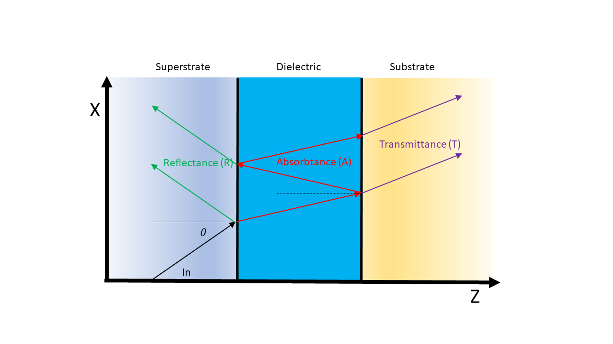
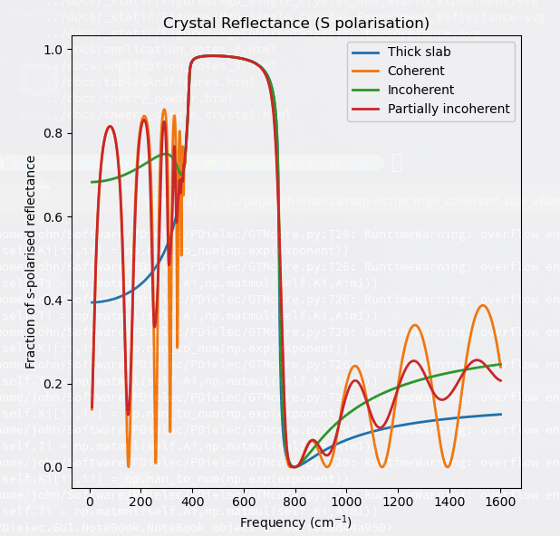
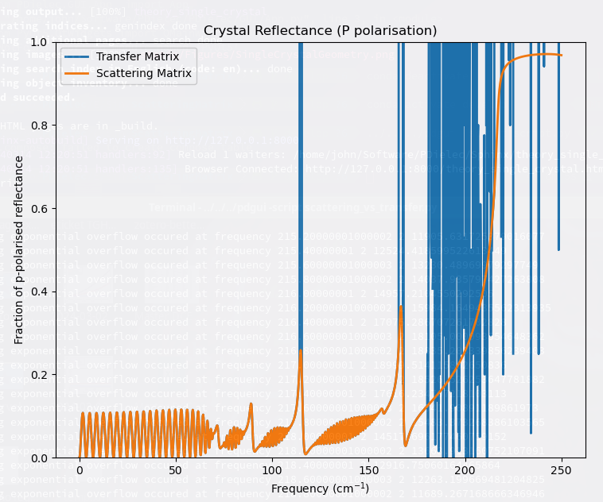
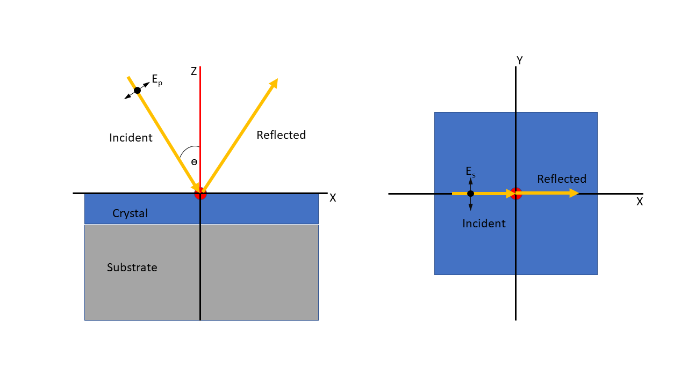

.. include:: preamble.txt

..
    .. contents::
       :local:
..

.. meta::
   :description: PDielec package for the calculation of infrared and terahertz absorption from QM calculations
   :keywords: Quantum Mechanics, Effective Field Theory, Maxwell, Garnett, Mie, Infrared, Terahertz, Castep, Abinit, VASP, GULP. QE

.. _Single-Crystal-Theory:

================================
Theory for Single Crystal Optics
================================

The *SingleCrystal tab* enables the calculation of the optical behaviour of a layer of crystalline films.
The methods used are based on the pyGTM code available on GitHub :cite:`pygtm`.
This code implements a general transfer matrix method described by Passler et al. :cite:`Passler2020` and that builds on previous publications :cite:`Passler2017,Passler2017a`.
The code has been modified substantially to model incoherent and coherent systems.
Also a scattering matrix has been implemented as described in the PyLlama software documentation :cite:`PyLlama2022`

A summary of the theory underlying the transfer and scattering matrix methods is given to aid in the understanding of the methods implemented and the range of their applications.

In general PDGui can handle multilayered frequency-dependent films, sandwiched between a superstrate and a substrate.  
For the sake of simplicity, the following will describe a system with a single dielectric (which is defined from the calculated permittivity from a DFT calculation or an experimental file. 
The media will be indexed 0, 1 and 2 for the superstrate, dielectric and substrate respectively.
A schematic illustrating this is shown in :numref:`fig-definition-of-RTA`.
To aid understanding of the input and output and the limitations of the methods used, a brief summary of the transfer matrix method is given first, specific to its application in PDGui.
This will be followed by a description of the scattering matrix approach as implemented in the package.
The treatment of light transmission and reflection in incoherent media will also be outlined.

.. _fig-definition-of-RTA:

   Layers used to calculate Transmittance, Reflectance and Absorptance

The Transfer Matrix 
-------------------

At an interface, the tangential (in-plane) electric and magnetic fields (given by a vector :math:`\fieldbf{F_i}`) match in both media.  
This requires that the 4 amplitudes (vector :math:`\fieldbf{A_i}`) of the electric and magnetic fields, forward and backward, s- and p- polarised, in medium :math:`i` are related through a 4x4 dynamical matrix :math:`\tensorbf{D_i}`.

.. math::
   :label: eq-dynamical-matrix

   \fieldbf{F}_i  = \tensorbf{D}_i \fieldbf{A}_i

Requiring that the in-plane fields match in both media at an interface gives;

.. math::
   :label: eq-field-matching
    
   \fieldbf{F}_{i-1}                    &= \fieldbf{F}_i                \\
   \tensorbf{D}_{i-1} \fieldbf{A}_{i-1} &= \tensorbf{D}_i \fieldbf{A}_i \\
   \fieldbf{A}_{i-1}                    &= \tensorbf{D}_{i-1}^{-1} \tensorbf{D}_i \fieldbf{A}_i

Within a given, homogeneous, layer the mode amplitudes will change according to the propagation through the medium described by an diagonal exponential matrix :math:`\tensorbf{P}_i`.  Thus the amplitudes on the left side of a layer are related to those on the right side by;
      
.. math::
   :label: eq-propagation

   \fieldbf{A}_{i,left}  = \tensorbf{P}_i \fieldbf{A}_{i,right}

The total transfer matrix for the 3 media considered (superstrate, dielectric and substrate; 0, 1 and 2 respectively) is therefore;

.. math::
   :label: eq-transfer-matrix

   \tensorbf{T}  = 
                 \tensorbf{D}_0^{-1}
                 (\tensorbf{D}_1
                 \tensorbf{P}_1
                 \tensorbf{D}_1^{-1})
                 \tensorbf{D}_2

The elements of the total 4x4 transfer matrix :math:`\tensorbf{T}` can be used to determine the total reflectance and transmittance for each s- and p- mode.

For the multi-layer case it is straightforward to generalise this expression by writing the transfer matrix, :math:`\tensorbf{T}_i`, for the :math:`i'th` layer as:

.. math::
   :label: eq-transfer-matrix2

   \tensorbf{T}_i  = 
                 \tensorbf{D}_i
                 \tensorbf{P}_i
                 \tensorbf{D}_i^{-1}

The total transfer matrix for the whole system consisting of a superstrate, :math:`N` layers and a substrate can then be written:

.. math::
   :label: eq-transfer-matrix3

   \tensorbf{T}  = 
                 \tensorbf{D}_0^{-1}
                 \left( \prod_{i=1}^N \tensorbf{T}_i \right)
                 \tensorbf{D}_{N+1}

The role of the total transfer matrix is to convert the field amplitudes on the left-hand side (the incident amplitudes) to those on the right-hand side (the transmitted amplitudes).

The Scattering Matrix
---------------------
Unfortunately, transfer matrix theory is known to exhibit serious numerical instabilities when the layers become thick.
This is mainly due to the fact that the forward waves (which move from left to right) are defined as the layers in the transform matrix are being added from right to left.  
The forward moving wave is growing in amplitude as the layers are being added and this leads to all kinds of instabilities.
The scattering matrix method overcomes this problem by providing a matrix for each layer which couples the incoming waves (two from the left and two from the right) to the outgoing waves.  
In this way it is possible to describe waves which are always decreasing in amplitude.
To demonstrate the difference between the approaches the transfer matrix connects fields in one layer to those in the next layer:

.. math::
   :label: eq-transfer-matrix4

   \begin{bmatrix}
     \fieldbf{F}_{i+1}^+  \\
     \fieldbf{F}_{i+1}^-
   \end{bmatrix}
      = \tensorbf{T}_i
   \begin{bmatrix}
   \fieldbf{F}_{i}^+  \\
   \fieldbf{F}_{i}^-
   \end{bmatrix}

The scattering matrix for this is written;

.. math::
   :label: eq-scattering-matrix

   \begin{bmatrix}
     \fieldbf{F}_{i}^- \\
     \fieldbf{F}_{i+1}^+ 
   \end{bmatrix}
      = \tensorbf{S}_i
   \begin{bmatrix}
   \fieldbf{F}_{i}^+  \\
   \fieldbf{F}_{i+1}^-
   \end{bmatrix}

The fields on the right-hand side represent light entering the layer and the fields on the left-hand side represent light leaving the layer.  The fields in these expressions are two component vectors representing the p- and s- fields. The superscripts '+' and '-' indicate forward and backward moving light respectively.
It should be noted that this definition is slightly different to the definition used by PyLlama.

The scattering matrix is more complicated to handle than the transfer matrix.  Scattering matrices between different layers can be combined using the Redheffer product :cite:`Rumpf2011a`

.. math::
   :label: eq-redheffer

   \tensorbf{S}  = 
                 \tensorbf{S}_0 \otimes ... \tensorbf{S}_i \otimes \tensorbf{S}_{i+1} \otimes ... \tensorbf{S}_N

The transfer matrix method in PDGui is provided by a modified version of the pyGTM :cite:`pygtm`.
A full description of the method is provided by Passler et al. :cite:`Passler2020`.
The scattering matrix method was implemented within the pyGTM framework using the algorithms suggested in PyLama :cite:`PyLlama2022`, with some modifications.

Incoherence
-----------
Because the above approaches use amplitudes there is always the possibility that a mismatch in phase for a reflected or transmitted wave will result in interference and therefore oscillations (etalons) in intensity as the frequency is changed.
Experimentally, for thick crystals, it is known that the presence of defects in the crystal and at the interfaces, and differences in thickness cause this coherence to be lost and instead incoherent light transmission is observed and the etalons are lost.
PDielec implements several schemes treating incoherence.

The "Incoherent (intensity)" method creates a transfer matrix like that in :eq:`eq-transfer-matrix`, but instead of amplitudes, uses intensities for the transfer matrix of the dielectric. 
This method has not been implemented for the scattering matrix formalism although such an approach has been implemented in FSRStools :cite:`FSRStools` a Python implementation of Yeh's transfer matrix method :cite:`Yeh1980`.
The theory is described by Beck :cite:`Beck2012` and by Katsidis and Siapkas :cite:`Katsidis2002`.
This approach has been incorporated in PDGui by modifying the total transfer matrix as follows;

.. math::
   :label: eq-transfer-matrix-int

   \tensorbf{T}_{int} =  \mid \tensorbf{D}_0^{-1} \tensorbf{D}_1 \mid^2 \mid \tensorbf{P}_1 \mid ^2 \mid \tensorbf{D}_1^{-1} \tensorbf{D}_2 \mid ^2

The use of intensities instead of amplitudes ensures that the phase information is lost.
The actual implementation is appropriate for a multi-layer system where all dielectric layers are treated as being incoherent films, whatever their thickness.

The "Incoherent (phase averaging)" method, which is implemented for both transform and scattering matrix formalisms, instead averages over the phase of the propagating matrix (:math:`\tensorbf{P}_i`) for the backward travelling waves in the incoherent material.

.. math::
   :label: eq-incoherent-averaging

    \tensor{P}_i = \begin{bmatrix}
        e^{-ik_0 d_i q_i^1} & 0 & 0 & 0 \\
        0 & e^{-ik_0 d_i q_i^2} & 0 & 0 \\
        0 & 0 & e^{-ik_0 d_i q_i^3} & 0 \\
        0 & 0 & 0 & e^{-ik_0 d_i q_i^4} 
       \end{bmatrix}

The layer thickness is :math:`d_i`, :math:`\fieldbf{q}_i` are the wavevectors of the 4 modes.
The backward travelling waves are modified by adding a phase between 0 and :math:`2 \pi`.  Early implementations of this method chose the phase at random and the final results were averaged over many phases :cite:`Troparevsky2010`.
It has been shown :cite:`Santbergen2013` that a more efficient procedure is to average over an equally spaced range of phases.  
In PDGui 10 equally spaced phases are used and the full range of possible phase variation is considered.  
In principle it is also possible to treat some partial incoherence by limiting the range of phases considered.

A third method for treating incoherence, called "Incoherent (non-reflective)" is also implemented for both transfer and scattering matrix methods.  This method sets the amplitude of the internally reflected wave to zero.
This has the effect of artificially increasing the absorptance in the layer.

For all methods, the absorptance (:math:`A`) is defined from the reflectance (:math:`R`) and transmittance (:math:`T`) as below;

.. math::
   :label: full_absorptance

   A = 1 - R - T

Comparison of computational approaches
--------------------------------------

:numref:`fig-mode-comparison` shows a comparison of the approaches discussed above applied to MgO.
The DFT calculations were performed by Castep.  The incident angle is 45\ :superscript:`o` and the film thickness is 10\ |micron|.
The calculations were performed using the transform matrix method.
The 'Coherent' curve shows large amplitude oscillations before and after the Reststrahlen region of absorption.
The 'Incoherent (phase averaging)' and 'Incoherent (intensity)' are similar at high frequencies, but at low frequencies the intensity calculation shows higher reflectance.

.. _fig-mode-comparison:

   Comparison of Incoherent Methods

With the transfer matrix method, it is common to see numerical problems in regions where the extinction coefficient is high and the dielectric is thick.  The numerical problems manifest themselves with either with sudden spikes in reflectance or with a 'Warning exponential overflow occured' message.

These problems manifest themselves acutely in calculations on l-alanine.  The DFT calculations were performed by Crystal.  :numref:`fig-tm-sm-comparison` shows the predicted p-polarised reflection for a 1mm film of the (001) surface with an azimuthal angle of 90\ :superscript:`o`.

.. _fig-tm-sm-comparison:

   Comparison of Transfer and Scattering Matrix and Methods

The transfer and scattering matrix methods agree well with each other upto about 114 |cm-1|.  Above 180 |cm-1| the transfer matrix method is completely unstable, while the scattering matrix method works well.

.. _crystal-and-laboratory-coordinates:

Crystal & Laboratory Coordinate Frames
--------------------------------------
There are two coordinate systems to consider.  The first is the laboratory coordinate system (X,Y,Z).  
It is assumed that the normal to the crystal surface is aligned with the Z-axis and that the incident radiation is in the X-Z plane.  p-polarised light is polarised parallel to this plane and s-polarised perpendicular (senkrecht) to this plane.  
The laboratory frame is illustrated in :numref:`fig-lab-coords2`.

The other coordinate system of interest is that of the crystal.  The calculation of the permittivity tensor is performed in the crystal coordinate system (x,y,z).  The crystal plane is defined by a set of Miller indices (hkl) and the normal to the crystal surface is rotated to align with the laboratory Z-axis.  Finally in the laboratory frame the crystal may be rotated around the Z-axis by the azimuthal angle :math:`\phi`.
The precise definition of the azimuthal angle is somewhat arbitrary as it depends on the crystal unit-cell definition, but PDGui provides information of the details of the relationship between the crystal axes and the laboratory frame.
The arrangement described is illustrated in the Figure below where :math:`E_s` and :math:`E_p` are the field directions of the s- and p- polarised incident light respectively. 
Information about the crystal coordinates relative to the laboratory frame is given in the GUI.

.. _fig-lab-coords2:

   Definition of single crystal laboratory coordinates in PDGui

